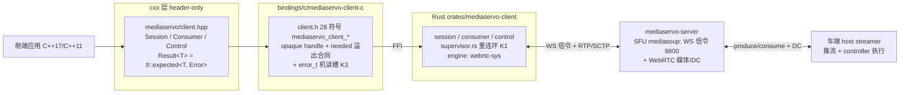
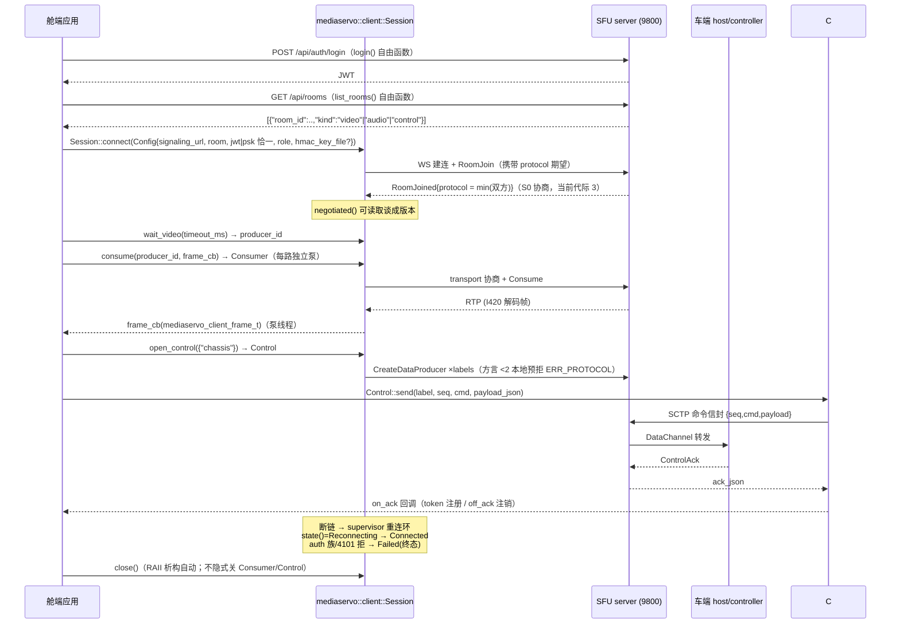

# MediaServo client C++ SDK 手册（舱端/消费侧）

> 状态: active · 2026-09-23 · 事实源 = `bindings/cxx/mediaservo-client-cxx/include/mediaservo/client.hpp`
> 与 `bindings/c/mediaservo-client-c/include/mediaservo/client.h`（S6 批1b 后 28 符号 C 面，本文逐名核对）

## 1. 定位与适用场景

`mediaservo::client`（C++ header-only 绑定，over `mediaservo_client_*` C ABI）是**舱端/消费侧
SDK**：账号登录换 JWT → 房间发现 → 入房消费 SFU 视频 → 控制 DataChannel 出程命令与 ack 回程
→ 急停双路投递。按项目约定 C4 修订：client = 消费端/参会者 SDK（拉流为主 + 遥控能力位，
控制权限由 server 账号 `can_control` 裁决，非本地角色）。

典型场景：

| 场景 | 用法 |
|------|------|
| 遥控驾驶舱 | `list_rooms` 发现流房 + 整车控制房 → 双 Session 配对（见 §8 双房约定）→ `consume` 视频 + `open_control`/`send`/`on_ack` 遥控回路 |
| 监控墙 / NVR 回放端 | 多路 `Session::consume`（K4 每路独立泵，互不连坐）+ `Consumer::stats` mini 读数 |
| 安全急停 | `Session::emergency_stop`（HMAC 签名形，W4b） |
| ROS2 舱端桥接 | `bindings/cxx/mediaservo-client-cxx/examples/ros2_node/`（pkg-config 消费形） |

不适用：推流/采集侧（那是 `mediaservo::field` / host 二进制面）。

## 2. 原理与架构

三层结构：C++ RAII 薄层（header-only，零编译）→ C ABI 稳定面（28 符号，`extern "C"`）→
Rust `mediaservo-client` crate（cdylib `libmediaservo_client.so`）。



要点（均出自头文件契约注释）：

- **命名空间**：cxx 层在 `mediaservo::client`（`Session` / `Consumer` / `Control` / `Config` /
  `State` / `DcState`），错误类型复用 `mediaservo::Error` / `mediaservo::Result`
  （`bindings/cxx/include/mediaservo/detail/result.hpp`）。
- **S6 批1b 改名**：C 符号全量 `ms_client_*` → `mediaservo_client_*`，**零别名**（旧符号直接消失）。
- **⊘ 旧形保留一周期**（行为重映射，非新语义）：`last_error` 全局槽 / `consume_video` 首路 /
  `video_stats` 会话 union——新代码用句柄级错误 + `wait_video`+`consume` 多路 + `Consumer::stats`。
- **错误通道为 Result（非异常）**；误用 `value()`/`error()` 抛 `tl::bad_expected_access<Error>`。
- 所有阻塞调用在进程级共享 multi_thread tokio runtime 上 `block_on`；ack 泵 / WS 读循环 /
  帧泵为后台任务。

## 3. 生命周期时序



重连/监督行为（supervisor.rs K1，经 C 面观测）：`Session::state()` 快照 +
`Session::on_state(cb)` 回调（**只报变化**，初始态用 `state()` 自取）。线值：
`Disconnected(0)`（auto_reconnect 关且断链）/ `Connected(1)` / `Reconnecting(2)`（重连环内）/
`Failed(3)`（不可重试拒：auth 族 / 4101，终态）。注：`set_auto_reconnect` 存在于 Rust 面，
**C/cxx 28 符号面未暴露开关**（默认常开重连环）。

## 4. API 表（cxx 层，逐名照抄 client.hpp）

### 自由函数

| 签名 | 说明 |
|------|------|
| `Result<std::string> version()` | SDK 版本 `MAJOR.MINOR.PATCH` |
| `Result<std::string> login(const std::string& http_base_url, const std::string& username, const std::string& password)` | POST `{base}/api/auth/login` 换 JWT（阻塞；v1 仅明文 http） |
| `Result<std::string> list_rooms(const std::string& http_base, const std::string& jwt)` | GET `{base}/api/rooms`，返回 JSON 数组 `[{"room_id":..,"kind":..}]`，本层不解析；token 失效/角色不符 → `ERR_UNAUTHORIZED` |

### struct Config

```cpp
struct Config {
    std::string signaling_url; // "ws://host:9800/ws"
    std::string room;          // 房间 ID
    std::string jwt;           // login() 输出（与 psk 恰一非空）
    std::string hmac_key_file; // 急停密钥文件（0600；空 = 不签名）
    std::string psk;           // PSK 直传（与 jwt 恰一非空）
    std::string role;          // "Client"(默认)/"Viewer"/"Remote"；空串 = "Client"
};
```

注：`Client`/`Viewer` 本地同形（PeerRole::Consumer），控制权限差异由 server 账号
`can_control` 门裁决；`Remote` = 舱对端角色。

### class Session（move-only RAII，析构自动 close，默认构造 = 已关闭）

| 签名 | 说明 |
|------|------|
| `static Result<Session> connect(const Config& cfg)` | 信令连接 + 入房（阻塞） |
| `Result<uint32_t> negotiated() const` | 谈成方言版本（S0；旧 server = 1） |
| `Result<State> state() const` | 连接态快照（重连环观测面） |
| `Result<void> on_state(std::function<void(State)> cb)` | 累积注册态回调；不可注销，随 close 释放 |
| `Result<std::string> wait_video(uint64_t timeout_ms)` | 纯等待房间内视频 producer，返回 producer_id；超时 `ERR_TIMEOUT`、断链 `ERR_STATE` |
| `Result<Consumer> consume(const std::string& producer_id, std::function<void(const mediaservo_client_frame_t&)> cb)` | 订阅一路视频（K4 多路，每路独立泵互不连坐） |
| `Result<void> consume_video(cb)` | ⊘ 首路桥（保留一周期；重复调用 = `ERR_STATE`）；新代码用 wait_video+consume |
| `Result<std::string> video_stats()` | ⊘ 会话级 union JSON；多路精确读数用 `Consumer::stats()` |
| `Result<Control> open_control(const std::vector<std::string>& labels)` | 出程控制通道集（每会话一次性；方言 <2 本地预拒） |
| `Result<void> emergency_stop(const Control& ctl, const std::string& label, uint64_t seq, const std::string& payload_json)` | 急停双路投递（DC 快路径 + 信令审计副本）；OK = 投递成功非已执行 |
| `Result<void> close() noexcept` | 幂等；join 泵 + 逐条 user_free；**不隐式关 Consumer/Control** |

### class Consumer（move-only RAII；Session.close 不隐式关它）

| 签名 | 说明 |
|------|------|
| `std::string id() const` | 本路 producer id（已关闭/失败 = 空串） |
| `Result<std::string> stats()` | 单路视频统计 JSON（键表同 video_stats） |
| `Result<void> close() noexcept` | 幂等；join 泵 ≤250ms；user_free 恰好一次 |

### class Control（move-only RAII）

| 签名 | 说明 |
|------|------|
| `Result<uint64_t> on_ack(std::function<void(const std::string&)> cb)` | 累积注册 ack 回调，返回注销凭据 token；首次注册启动泵 |
| `Result<void> off_ack(uint64_t token)` | 按 token 注销（泵下轮回收 ≤1s；在途轮次可能仍触发一次） |
| `Result<void> send(const std::string& label, uint64_t seq, const std::string& cmd, const std::string& payload_json)` | 命令信封 {seq,cmd,payload}；payload_json ""=null；seq 调用方自增（D-H3 重发幂等安全） |
| `Result<DcState> ready_state() const` | DC 就绪态（发送/急停前门禁用）：Connecting(0)/Open(1)/Closing(2)/Closed(3) |
| `Result<uint64_t> buffered_amount()` | SCTP 背压水位字节数（0 = 可安全追加） |
| `Result<std::string> producer_ids()` | server 分配的 data producer id JSON 数组（观测面） |
| `Result<void> close() noexcept` | 幂等；join ack 泵后全量回收注册表 |

### Error（机读形，`bindings/cxx/include/mediaservo/detail/result.hpp`）

```cpp
struct Error {
    int code;             // MEDIASERVO_CLIENT_ERR_*（见 §6）
    std::string message;  // 人读详情（句柄级或全局 last_error）
    uint16_t wire_code;   // server wire 码回读（0 = 本地/无码域），如 4012 ControlDenied
    bool retryable;       // 可重试族（D273 分类的 C 镜像）
};
```

会话句柄形调用失败时 wire_code/retryable 经 `mediaservo_client_session_error` 读回（K3）；
自由函数/守卫路径该两位 = 0/false。C 侧对应 `mediaservo_client_error_t{struct_size, code,
wire_code, retryable}`，`struct_size` 必填 `sizeof`。

### needed 缓冲合同（list_rooms / wait_video / video_stats / consumer id+stats / producer_ids / login）

C 面出参为 `(char* buf, size_t cap, size_t* needed)`：cap 不足 → `*needed` 写入必需字节数
（含 NUL）+ 返回 `ERR_INVALID_ARG`（不写半截）。cxx 层 `detail::needed_read` 已封装为
**首调 4KiB、溢出按 needed 自动扩一次重试、>64KiB 拒**——C++ 调用方只见 `Result<std::string>`，
无需自管缓冲。

## 5. 用法示例

### 5.1 编译期自证测试（真实代码，免网络）

`bindings/cxx/mediaservo-client-cxx/tests/test_client.cpp`（191 行，14 个断言用例：version /
login 参数守卫 / connect 凭证恰一 / 回环死端口 typed error / 默认构造 closed 语义 / move 语义 /
State 线值合同 / Consumer closed 语义 / Error 机读位 / strerror C 面）。编译行（文件头注释原文）：

```bash
g++ -std=c++17 -I bindings/cxx/include -I bindings/c/include \
    -I bindings/c/mediaservo-client-c/include \
    -I bindings/cxx/mediaservo-client-cxx/include \
    bindings/cxx/mediaservo-client-cxx/tests/test_client.cpp \
    -L target/debug -lmediaservo_client -o /tmp/test_client_cxx
```

代表性用例（逐字摘自 test_client.cpp）：

```cpp
static void test_default_constructed_closed() {
    Session s;
    assert(!static_cast<bool>(s));
    auto n = s.negotiated();
    assert(!n.has_value());
    assert(n.error().code == MEDIASERVO_CLIENT_ERR_INVALID_ARG);
    assert(n.error().message == "closed");
}
```

### 5.2 无头遥控闭环（真实代码）

`bindings/cxx/examples/control_demo/main.cpp`（95 行，login→join→open_control→on_ack→
12× 同 seq 重发 steer→任一 ack 到达 exit 0）。核心段逐字摘录：

```cpp
auto token = ms::login(http_base, user, pass);
if (!token) { fail("login", token.error()); return 1; }

ms::Config cfg;
cfg.signaling_url = ws_url;
cfg.room = room;
cfg.jwt = token.value();
cfg.role = "Client";
auto session = ms::Session::connect(cfg);
if (!session) { fail("session connect", session.error()); return 1; }

auto ctl = session->open_control({label});
auto hooked = ctl->on_ack([](const std::string& ack_json) {
    std::printf("ack: %s\n", ack_json.c_str());
    g_ack_received.store(true);
});

const uint64_t seq = 1;
for (int attempt = 0; attempt < 12 && !g_ack_received.load(); ++attempt) {
    auto sent = ctl->send(label, seq, "steer", "{\"deg\":0.0}");
    if (!sent) { fail("send", sent.error()); return 1; }
    std::this_thread::sleep_for(std::chrono::seconds(5));
}
// RAII: ctl → session 逆序析构即正序 close
```

端点/凭证全走环境变量（`MSRTC_HTTP_BASE` / `MSRTC_WS_URL` / `MSRTC_ROOM` / `MSRTC_USER` /
`MSRTC_PASS`，可选 `MSRTC_LABEL`），无默认值——G13 纪律。

### 5.3 多路视频消费（真实 C 面用法，转写 cxx 形）

C 头文件用法注释（client.h 文件头，真实序列）的 RAII 转写：

```cpp
auto pid = session.wait_video(30000);            // Result<std::string> producer_id
if (!pid) { /* ERR_TIMEOUT / ERR_STATE */ }
auto cons = session.consume(pid.value(), [](const mediaservo_client_frame_t& f) {
    // f.data = I420 平面连续，f.len 字节；仅回调内有效，需保留请拷贝
    // 回调在泵线程触发，必须快速返回；禁止在回调内调用任何 client API（含 close）
});
auto stats = cons->stats();                       // 单路读数 JSON
```

> 说明：多路 `wait_video+consume` 的 cxx 完整可运行 example 在仓内暂无
> （imgui_viewer 现用 ⊘ `consume_video` 首路桥，见其 main.cpp L203）；上段为
> client.h 文件头真实 C 序列的逐行 RAII 转写，非假代码。

### 5.4 急停（真实代码，imgui_viewer）

`bindings/cxx/examples/imgui_viewer/src/main.cpp` L400 附近：
`t->sess.emergency_stop(*t->ctl, "chassis", 900, payload)`——签名态由
`Config::hmac_key_file` 决定（见 §8.2）。

## 6. 错误语义

### 错误码（client.h 逐字，0 = OK，<0 = 错误）

| 宏 | 值 | 语义 |
|----|----|------|
| `MEDIASERVO_CLIENT_ERR_INVALID_ARG` | -1 | 参数非法 / 已关闭对象调用（cxx 守卫 message="closed"）/ needed 溢出合同 |
| `MEDIASERVO_CLIENT_ERR_LOGIN` | -2 | 登录请求/解析失败 |
| `MEDIASERVO_CLIENT_ERR_UNAUTHORIZED` | -3 | InvalidCredentials / AuthRejected(4003/4010/4011) / RestRejected(REST 发现面非 2xx) |
| `MEDIASERVO_CLIENT_ERR_DENIED` | -4 | ControlDenied（server 4012） |
| `MEDIASERVO_CLIENT_ERR_TIMEOUT` | -5 | Timeout{what} |
| `MEDIASERVO_CLIENT_ERR_SIGNAL` | -6 | Signal/LinkError（WS 建连/断连/收发） |
| `MEDIASERVO_CLIENT_ERR_PROTOCOL` | -7 | ProtocolTooLow / ProtocolUnsupported / 4101 |
| `MEDIASERVO_CLIENT_ERR_MALFORMED` | -8 | MalformedResponse / UnsupportedScheme |
| `MEDIASERVO_CLIENT_ERR_STATE` | -9 | InvalidState（未开通道 / 会话或泵已关 / consume_video 重复调用） |
| `MEDIASERVO_CLIENT_ERR_INTERNAL` | -10 | Server(非分类码) / WebRtc / Io / panic 兜底 |

`mediaservo_client_strerror(code, buf, cap)` 提供静态文案（截断不报错；未知码 "unknown error code"）。

### 错误槽：句柄级 vs 全局（K3，一周期双写）

- **新代码**：会话句柄形失败读 `mediaservo_client_session_error`（机读 code/wire_code/retryable）
  + `mediaservo_client_session_last_error`（文本）。cxx 层 `detail::make_error(code, h)` 已自动走此形。
- **⊘ 全局**：`mediaservo_client_last_error`（进程级，线程安全）保留一周期兜底——
  缓冲溢出（needed 合同）类失败**只**走返回码 + 全局槽，不进句柄槽。
- 自由函数（login/list_rooms/version）与 cxx 守卫路径无句柄 → 读全局槽，wire_code/retryable = 0/false。

### retryable 分类（D273 的 C 镜像）

`Error::retryable == true` = 可重试族（瞬态，重连/重发有意义）；false 且 `wire_code` 落在
auth 族（4003/4010/4011）或 4101 = 终态拒——supervisor 重连环即退出，`state()` 停在 `Failed`。
`Control::send` 收到 -4（4012 ControlDenied）= 账号无控制权限，重发无意义，走人话报错。

## 7. 构建与链接

前置：`pixi run build-c`（或 `./mediaservo.sh build bindings`）产出
`target/debug/libmediaservo_client.so`（+ `.so.0` dev symlink）。cxx 层 header-only，零编译产物。

### 7.1 仓内直编（开发姿态）

```bash
g++ -std=c++17 \
  -I bindings/c/include -I bindings/cxx/include \
  -I bindings/c/mediaservo-client-c/include -I bindings/cxx/mediaservo-client-cxx/include \
  your_app.cpp -L target/debug -lmediaservo_client -Wl,-rpath,$PWD/target/debug
```

### 7.2 find_package（交付树姿态）

`./msrtc.sh build bindings`（或 `deploy bindings --prefix ...`）组装 `out/bindings/`：
`lib/`（version-full 三件套 + cmake/）+ `include/mediaservo/`（C 头 + cxx 头）+ `pkgconfig/` + `cmake/`。

```cmake
find_package(mediaservo REQUIRED COMPONENTS client)   # 版本检查 SameMajorVersion（ABI MAJOR，D241）
target_link_libraries(my_app PRIVATE mediaservo::client)  # INTERFACE 导入目标 = include + libmediaservo_client.so
```

`mediaservo::client` 为单包多组件模式（OpenCV/Boost 惯例）中的第四组件（field/link/deck/client，
`ALL_SDKS` 常量驱动渲染）；未知组件名 = configure 期 FATAL_ERROR。sdk-client 交付包只含 client
组件（cmake config 按域重渲染 SDK_LIST，消费者见不到别半区组件）。

### 7.3 pkg-config

```bash
pkg-config --cflags --libs mediaservo-client   # -I${prefix}/include -L${libdir} -lmediaservo_client
```

（ros2_node 样例即用此形：`find_package(PkgConfig)`。）

### 7.4 四家族测试门

```bash
scripts/test-cxx.sh   # field/link/deck/client 四 SDK cxx 测试 + common Result 契约，C++11 兼容编译
```

逐 sdk 用 `g++ -std=c++11 -Wall -Wextra` 编译其 `tests/test_<sdk>.cpp` 并运行；client 案即
§5.1 的 test_client.cpp。前置 = `build-c` 三 cdylib 已构建。

## 8. 已知坑 / FAQ

### 8.1 双房约定（最容易踩）

媒体面与控制面**不同房间**（PIT-140 v2 + W4c 定性，出处 `bindings/cxx/examples/README.md`）：

| 面 | 房间 | list_rooms kind |
|----|------|-----------------|
| 视频/音频流 | `<整车房>_<流id>`（如 `vehicle_test`） | `video` / `audio` |
| 遥控/急停 | `<整车房>`（如 `vehicle`） | `control` |

单房间打两边 = 一边必空（流房无 chassis producer / 整车房无视频 producer → wait-producer 黑洞）。
舱端需**两个 Session 配对**（imgui_viewer 已按此接线，勾选流房自动并入整车控制房）。
音频房 kind 已可发现、消费面未接（README OUT 节在册）。

### 8.2 急停签名（HMAC，W4b）

- 密钥经 `Config::hmac_key_file` 传入，**不走 argv/env**（G13）；文件须 0600、非空、≤4KiB、
  尾换行自动剥离。
- 三态语义：未配 key = 不签名（车端**未**配 key → 迁移放行；车端**已**配 key → 车端拒签 =
  正确裁决，非静默丢失）。
- 路径坏不拦建会话——延迟到 `emergency_stop()` 调用点报 `ERR_INVALID_ARG`。
- `emergency_stop` 返回 OK = **投递成功，非"已执行"**；车端执行裁决看同 seq 的 ack 回执。
- 投递为双路：DC 快路径 + 信令审计副本（server 侧 estop_audit）。

### 8.3 控制 DataChannel 是 negotiated 形（非 in-band DCEP）

server（mediasoup worker）对数据通道 consumer **从不代发 in-band DCEP 打开**——本 SDK 内部
按 worker 分配的 stream_id 以带外 negotiated 形建立 DC，故应用面**没有**"on_datachannel"
事件可等。发送前门禁 = `Control::ready_state()` 应为 `Open`；车端 consumer attach 有事件链
时延（~20s 量级），**同 seq 重发幂等安全**（D-H3），control_demo 的 12×5s 重发循环即此用途。
ack 配对由调用方按 seq 自判（`on_ack` 累积注册，多注册者各自收全量）。

### 8.4 stats union 旧形映射（⊘ 一周期）

`Session::video_stats()` = 本会话全部 inbound-rtp **折叠**（多路混在一起，无消费者=全零），
键：`bytes_received / packets_received / packets_lost / frames_decoded / frame_width /
frame_height / frames_per_second`。多路精确读数必须用 `Consumer::stats()`（同键表、单路）。
旧固定缓冲盲点已在批1b 升为 needed 合同（producer_ids 同）。

### 8.5 回调纪律（C 契约，违反 = UB）

- 帧/ack/状态回调在**各自内部泵线程**触发；回调期间不持锁；必须快速返回。
- **回调内禁止调用任何 `mediaservo_client_*` API（含 close）**。
- `frame.data` 与 ack JSON 字符串仅回调内有效，跨线程使用先拷贝。
- handle 单线程属主；close 后调用任何 API = UB（cxx 层对已关闭对象返回 `Error{INVALID_ARG,"closed"}`
  拦截，不触 C）。
- close 顺序：先 Control 后 Session 为正序；`Session::close` **不隐式关** Consumer/Control
  （RAII 析构序覆盖此契约——demo 注释"逆序析构即正序 close"）。

### 8.6 其他

- **role 不裁决控制权限**：`Client`/`Viewer` 本地同形，能否开控制 DC 由 server 账号
  `can_control` 决定，拒 = 4012 → `ERR_DENIED`。
- **jwt/psk 恰一非空**：两者皆空或皆非空 → `ERR_INVALID_ARG`（connect 本地校验，不触网）。
- **协议代际**：当前 `SIGNALING_PROTOCOL_VERSION = 3`（S0 协商 + S0.5 resume 占代际）；
  对旧 server 谈成 1/2 时 `open_control` 方言 <2 本地预拒 `ERR_PROTOCOL`。
- **重连可观测不可关**：supervisor 重连环默认常开（C 面无 `set_auto_reconnect` 暴露，待核实是否规划中）；
  终态判据 = `state()==Failed` 且 wire_code 属 auth 族/4101。
- **⊘ login_config_t**：`mediaservo_client_login_config_t` 结构已不被消费（批1b login 转扁平
  参数形），批2 随 ⊘ 清单一并移除——新代码勿用。

---

## 附：核实状态与差异报告

- 28 符号 C 面：`grep` 实测 = 28，与任务简报一致；全部签名逐字抄自 client.h/client.hpp。
- 命名空间 `mediaservo::client`：属实（client.hpp L36-37）。
- State/DcState 线值、错误码表、needed 合同、双房约定、HMAC 语义、negotiated DC：均有头文件
  注释或 examples/README 出处，无 (待核实) 遗留项。
- 唯一 (待核实)：`set_auto_reconnect` 仅 Rust 面存在（session.rs L376），C/cxx 面未暴露——
  是否规划暴露未见于两文件注释，§3/§8.6 已按实况措辞。
- 差异一处：imgui_viewer 实际仍用 ⊘ `consume_video`（main.cpp L203）而非新多路形——
  多路 cxx 完整 example 缺位，§5.3 以 C 头文件真实序列转写补足并声明。
