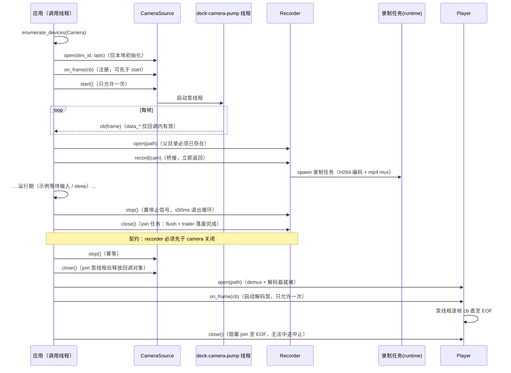

# mediaservo-deck C++ SDK 手册（采集 / 录制 / 回放）

> 状态: active · 2026-09-23 · 活参考（查用）。对象：`bindings/cxx/mediaservo-deck-cxx/include/mediaservo/deck.hpp`（header-only RAII）
> 与其下的 C ABI `bindings/c/mediaservo-deck-c/include/mediaservo/deck.h`。
> 所有签名逐字抄自上述头文件；行为语义抄自 `bindings/c/mediaservo-deck-c/src/lib.rs`。

## 1. 定位与适用场景

deck C++ 绑定是**媒体数据面 SDK**：本机相机采集 → H.264/MP4 录制 → 文件回放解码，一条不经过
WebRTC / server 的本地闭环。适用场景：

- **本地监控 / NVR**：设备端直采直录，无网络依赖；
- **边缘侧帧源**：为上层（field 组合 SDK、推流链路）提供统一采集入口与帧回调；
- **录制回放工具链**：C++ 宿主程序内嵌录像、逐帧解码取图。

不适用：任何需要网络传输的场景（那是 link/field/client 的地盘）；音频/屏幕采集当前枚举表为空（见 §8）。

## 2. 原理与架构

C++ 层是 **header-only 薄包装**（`mediaservo-deck-cxx/src/lib.rs` 为空载体 crate，仅承载测试与
分发元数据），全部实现下沉到 C ABI cdylib `libmediaservo_deck.so`：

```mermaid
flowchart TD
    subgraph 宿主进程
        A["C++ 层 deck.hpp<br/>(header-only RAII, move-only handle)"]
        B["C ABI 层 libmediaservo_deck.so<br/>deck-c/src/lib.rs (opaque handle + int 错误码)"]
        C["Rust deck crate<br/>crates/mediaservo-deck<br/>source / record / playback"]
        D["mediaservo-codec<br/>(FFmpeg 后端 backend-ffmpeg)"]
        E["mediaservo-media<br/>VideoFrameGenerator (stub 帧源)"]
        F["FFmpeg (ffmpeg-the-third 6)<br/>静态链接进 .so + --exclude-libs,ALL"]
    end
    A -->|"extern \"C\" 调用"| B
    B --> C
    C -->|"H264 编码 / mp4 mux / demux+decode"| D
    C -->|"采集 MVP = 生成器帧源"| E
    D --> F
```

要点（均有代码依据）：

- **每 handle 一个 tokio multi-thread runtime（2 worker）+ 独立泵线程**：camera 泵线程
  `deck-camera-pump` 以 50ms 超时轮询帧流并检查 stop/closed 标志（`lib.rs` `camera_pump_loop`）；
  recorder 录制任务 spawn 到共享 runtime；player 泵线程 `deck-player-pump` 同步 `next_frame` 循环。
- **录制桥**：`Recorder::record(camera)` 在 C 层实现为 camera 泵 → unbounded channel → 录制任务
  （`lib.rs` `deliver_frame` 的 `rec_tx` 扇出），即帧回调与录制共用同一个泵。
- **FrameBus 互操作**：Rust 侧存在闭环演练（`crates/mediaservo-deck/tests/closed_loop.rs`：
  CameraSource → FrameBus 发布 → 订阅 → Recorder），**但 C/C++ ABI 面没有任何 FrameBus 入口**——
  C++ 消费者拿不到该能力，勿在文档之外假设其存在。
- **采集后端现状**：`crates/mediaservo-deck/src/source.rs` 模块头声明 MVP 为 stub 帧源
  （`VideoFrameGenerator` 彩条/方块图案），真实设备采集（GStreamer v4l2src）为 deck 后续版本。
  因此当前 C++ 面 `enumerate_devices(Camera)` 只会得到 `["stub:test-camera"]`。

## 3. 生命周期时序

调用顺序取自真实示例 `bindings/cxx/mediaservo-deck-cxx/examples/vehicle_deck.cpp`
（L26–L92）与 C 示例 `bindings/c/mediaservo-deck-c/examples/record_playback.c`（L33–L144）：



## 4. API 一览

### 4.1 C++ 共享错误层（`bindings/cxx/include/mediaservo/detail/result.hpp`）

| 项 | 签名（逐字） | 语义 |
|---|---|---|
| Error | `struct Error { int code; std::string message; uint16_t wire_code; bool retryable; };` | `code` = `MEDIASERVO_DECK_ERR_*`；`message` 读自 C 层 last_error；deck 家族 `wire_code` 恒 0、`retryable` 恒 false（仅 client 填充） |
| Result | `template <typename T> using Result = tl::expected<T, Error>;` | 原生 tl::expected API：`has_value()/value()/error()/value_or()`；对 error 调 `value()`（或对 ok 调 `error()`）抛 `tl::bad_expected_access<Error>` |

### 4.2 自由函数与类型（`namespace mediaservo::deck`，deck.hpp）

| 签名（逐字） | 语义 |
|---|---|
| `inline Result<std::string> version()` | SDK 版本 `MAJOR.MINOR.PATCH`（读自 C 层 `mediaservo_deck_version`） |
| `enum class DeviceKind { Camera = 0, Audio = 1, Screen = 2 };` | 设备种类，值与 C ABI `kind` 参数一致 |
| `struct CaptureOptions { uint32_t width = 1280; uint32_t height = 720; uint32_t framerate = 30; };` | 采集选项；映射到 C 结构（全 0 字段 = C 默认 1280x720@30） |
| `inline std::vector<std::string> enumerate_devices(DeviceKind kind)` | 枚举设备 id 列表（双调用封装；'\n' 分隔拆分）。**失败返回空列表，无错误通道**（头文件内 `ponytail:` 注记：spec 固定签名） |

### 4.3 `class CameraSource`（move-only RAII；析构自动 close；默认构造 = 已关闭）

| 签名（逐字） | 语义 / 错误 |
|---|---|
| `static Result<CameraSource> open(const std::string& dev_id, const CaptureOptions& opts = CaptureOptions{})` | 打开相机（仅本地初始化）。空 `dev_id` → `INVALID_ARG`；设备不在枚举表 → `DEVICE`；`opts.struct_size` 门在 C++ 层恒满足 |
| `CameraSource() noexcept` / 移动构造、移动赋值 / `~CameraSource()` | 拷贝被删除；移动转移句柄与回调登记；析构 `(void)close()` |
| `explicit operator bool() const noexcept` | 是否持有有效 handle |
| `Result<void> start()` | 开始产帧并启动泵线程；**只允许一次**，重复 → C 层 `STATE`；已关闭对象 → `INVALID_ARG, "closed"` |
| `Result<void> on_frame(detail::FrameCb cb)`（`FrameCb = std::function<void(const mediaservo_frame_t&)>`） | 注册帧回调（泵线程逐帧触发）。C 层重复注册替换旧回调；C++ 层旧回调堆对象**留到 close 才释放**（防泵线程 UAF）。已关闭 → `INVALID_ARG, "closed"` |
| `Result<void> stop() noexcept` | 停止产帧（幂等；已关闭直接返回 ok） |
| `Result<void> close() noexcept` | 关闭并释放 handle（幂等；join 泵线程后才释放回调对象） |

### 4.4 `class Recorder`（move-only RAII；析构自动 close）

| 签名（逐字） | 语义 / 错误 |
|---|---|
| `static Result<Recorder> open(const std::string& path)` | 创建录制器（默认 h264/mp4；不启动）。空 path → `INVALID_ARG`；父目录不存在 → `RECORDER`（C 层 NotFound 映射） |
| `Result<void> record(CameraSource& camera)` | 桥接录制：camera 帧泵 → recorder，立即返回。C++ 已关闭对象 → `INVALID_ARG, "closed"`（录制器检查优先）；C 层：recorder/camera 已关闭、camera 未 start、camera 已 stop、重复 record → 均 `STATE` |
| `Result<void> stop() noexcept` | 请求停止（幂等；停止信号 ≤50ms 生效，flush 在 close 完成） |
| `Result<void> close() noexcept` | join 录制任务（**flush + trailer 在此完成**）后释放 |

### 4.5 `class Player`（move-only RAII；析构自动 close）

| 签名（逐字） | 语义 / 错误 |
|---|---|
| `static Result<Player> open(const std::string& path)` | 打开媒体文件（demux + 解码器就绪）。空 path → `INVALID_ARG`；文件不存在/不支持 → `PLAYER` |
| `Result<void> on_frame(detail::FrameCb cb)` | 启动逐帧解码泵（**只允许一次**，重复 → `STATE`；运行至 EOF 自然结束） |
| `Result<void> close() noexcept` | **阻塞 join 解码泵至完成**（长文件需等待，无法中途中止——头文件 YAGNI 注记） |

### 4.6 C ABI 面（`bindings/c/mediaservo-deck-c/include/mediaservo/deck.h`，签名逐字）

```c
mediaservo_err_t mediaservo_deck_devices_enumerate(int kind, char* out_ids, size_t cap, size_t* out_len);
mediaservo_err_t mediaservo_deck_camera_open(const char* dev_id,
                             const mediaservo_deck_capture_options_t* opts,
                             mediaservo_deck_camera_t** out);
mediaservo_err_t mediaservo_deck_camera_start(mediaservo_deck_camera_t* c);
mediaservo_err_t mediaservo_deck_camera_frames_cb(mediaservo_deck_camera_t* c, mediaservo_deck_frame_cb cb, void* user);
mediaservo_err_t mediaservo_deck_camera_stop(mediaservo_deck_camera_t* c);
mediaservo_err_t mediaservo_deck_camera_close(mediaservo_deck_camera_t* c);
mediaservo_err_t mediaservo_deck_recorder_new(const char* path, mediaservo_deck_recorder_t** out);
mediaservo_err_t mediaservo_deck_recorder_record(mediaservo_deck_recorder_t* r, mediaservo_deck_camera_t* c);
mediaservo_err_t mediaservo_deck_recorder_stop(mediaservo_deck_recorder_t* r);
mediaservo_err_t mediaservo_deck_recorder_close(mediaservo_deck_recorder_t* r);
mediaservo_err_t mediaservo_deck_player_open(const char* path, mediaservo_deck_player_t** out);
mediaservo_err_t mediaservo_deck_player_frames_cb(mediaservo_deck_player_t* p, mediaservo_deck_frame_cb cb, void* user);
mediaservo_err_t mediaservo_deck_player_close(mediaservo_deck_player_t* p);
mediaservo_err_t mediaservo_deck_last_error(char* buf, size_t len);
mediaservo_err_t mediaservo_deck_version(char* buf, size_t len);
```

辅助类型（逐字，deck.h + common.h）：

```c
typedef struct mediaservo_deck_capture_options_t {
    size_t struct_size;           /* sizeof(mediaservo_deck_capture_options_t) */
    uint32_t width;               /* 视频宽 (0 = 默认 1280) */
    uint32_t height;              /* 视频高 (0 = 默认 720) */
    uint32_t framerate;           /* 帧率 (0 = 默认 30) */
} mediaservo_deck_capture_options_t;
#define MEDIASERVO_DECK_CAPTURE_OPTIONS_DEFAULT { sizeof(mediaservo_deck_capture_options_t), 0, 0, 0 }

typedef void (*mediaservo_deck_frame_cb)(const mediaservo_frame_t* frame, void* user);

typedef struct mediaservo_frame_t {
    uint32_t width;
    uint32_t height;
    uint64_t pts_us;        /* 演示时间戳 µs */
    uint32_t stride_y;
    uint32_t stride_u;
    uint32_t stride_v;
    const uint8_t* data_y;
    const uint8_t* data_u;
    const uint8_t* data_v;
} mediaservo_frame_t;
```

`devices_enumerate` 双调用约定（snprintf 风格）：第一次 `out_ids=NULL` 取所需长度（返回值 =
长度，不含 NUL；负值为错误）；第二次填缓冲，**截断时同样返回所需长度**；`out_len` 非空时两次均写回。
多设备以 `'\n'` 分隔；`kind`: 0=Camera 1=Audio 2=Screen。

## 5. 使用示例（均为仓内真实代码）

### 5.1 C++ 采集→录制→回放闭环（真实代码）

来源：`bindings/cxx/mediaservo-deck-cxx/examples/vehicle_deck.cpp` L26–L75（节选，回放段同理见 L78–L91；
需设环境变量 `MEDIASERVO_RECORD_PATH`）。

```cpp
auto cams = mediaservo::deck::enumerate_devices(DeviceKind::Camera);
if (cams.empty()) { std::cerr << "no camera devices\n"; return 1; }

CaptureOptions opts; // 默认 1280x720@30
auto cam_result = CameraSource::open(cams[0], opts);
if (!cam_result) {
    std::cerr << "camera open failed: code=" << cam_result.error().code
              << " msg=" << cam_result.error().message << "\n";
    return 1;
}
auto cam = std::move(cam_result).value();

// 帧回调（泵线程；frame 指针仅回调内有效——此处只打印，不保留）
auto cb = cam.on_frame([](const mediaservo_frame_t& frame) {
    std::cout << "frame " << frame.width << "x" << frame.height << "\n";
});
auto started = cam.start();

// 录制（camera 必须已 start 且活到录制结束 → recorder 先 close）
auto rec = std::move(Recorder::open(out_path).value());
auto recorded = rec.record(cam);

std::cin.get();

(void)rec.stop();   // 请求停止
(void)rec.close();  // 先关 recorder（flush + trailer）
(void)cam.stop();   // 后关 camera
(void)cam.close();
```

### 5.2 C++ 错误路径与已关闭语义（真实代码）

来源：`bindings/cxx/mediaservo-deck-cxx/tests/test_deck.cpp` L35–L55。

```cpp
// 空 dev_id → C ABI 快速 INVALID_ARG，不触硬件
auto r = CameraSource::open("");
assert(!r.has_value());
assert(r.error().code == MEDIASERVO_DECK_ERR_INVALID_ARG);
assert(!r.error().message.empty());

// 已关闭相机：start/on_frame → INVALID_ARG/"closed"
CameraSource c;
assert(!c);
auto st = c.start();
assert(st.error().code == MEDIASERVO_DECK_ERR_INVALID_ARG);
assert(st.error().message == "closed");
assert(c.stop().has_value());  // 幂等
assert(c.close().has_value()); // 幂等（C++ 层；C 层重复 close 同指针为 UB）
```

### 5.3 C ABI 消费（真实代码，节选）

来源：`bindings/c/mediaservo-deck-c/examples/record_playback.c` L39–L58、L94–L118。

```c
/* 1. 枚举相机（双调用模式: 第一次长度 → 第二次内容） */
size_t need = 0;
mediaservo_err_t rc = mediaservo_deck_devices_enumerate(0, NULL, 0, &need);
char dev[64];
rc = mediaservo_deck_devices_enumerate(0, dev, sizeof(dev), &need);

/* 2. 打开相机 + 开始产帧（默认 1280x720@30）+ 帧回调 */
mediaservo_deck_capture_options_t copts = MEDIASERVO_DECK_CAPTURE_OPTIONS_DEFAULT;
mediaservo_deck_camera_t* cam = NULL;
rc = mediaservo_deck_camera_open(dev, &copts, &cam);
rc = mediaservo_deck_camera_start(cam);
rc = mediaservo_deck_camera_frames_cb(cam, on_camera_frame, NULL);

/* 4. 停止录制 + 关闭（顺序: recorder 先于 camera — 生命周期契约） */
rc = mediaservo_deck_recorder_stop(rec);
rc = mediaservo_deck_recorder_close(rec);
rc = mediaservo_deck_camera_stop(cam);
rc = mediaservo_deck_camera_close(cam);
```

C 侧每个错误分支统一模式：`rc != MEDIASERVO_OK` → `mediaservo_deck_last_error(err, sizeof(err))` 取详情。

## 6. 错误与边界语义

### 6.1 错误码（deck.h 逐字）

```c
#define MEDIASERVO_DECK_ERR_INVALID_ARG  (-1)   /* 参数非法 / null 指针 / struct_size 过小 */
#define MEDIASERVO_DECK_ERR_DEVICE       (-2)   /* 设备枚举/打开失败 */
#define MEDIASERVO_DECK_ERR_RECORDER     (-3)   /* 录制域（路径不存在、mux 失败等） */
#define MEDIASERVO_DECK_ERR_PLAYER       (-4)   /* 回放域（文件不存在、demux/decode 失败等） */
#define MEDIASERVO_DECK_ERR_STATE        (-5)   /* 状态违例（重复 start、未 start 即 record 等） */
#define MEDIASERVO_DECK_ERR_INTERNAL     (-6)   /* 内部错误（含 panic 捕获、mutex poisoned） */
```

Rust `DeckError` → C 码按调用域映射（`lib.rs` `map_deck_err`）：`Device`→-2、`InvalidState`→-5、
`NotFound`/`Codec`/`Io` 按 Camera/Recorder/Player 上下文映射为 -2/-3/-4（Camera 的 Codec/Io → -6）；
未知变体统一 -6。所有导出函数经 `catch_unwind` 包裹，panic 不会穿越 FFI。

### 6.2 last_error 通道

- `mediaservo_deck_last_error(buf, len)` 线程安全；无错误时返回空串；超长截断 + NUL。
- **进程级全局单槽**（`static LAST_ERROR`）：任何线程的任何一次失败调用都会覆写它。并发消费
  （或多测试用例并跑）时「先调用、后读错误」不是原子对——deck-c 测试自身即因此引入文件内
  `TEST_LOCK` 串行（`lib.rs` 测试模块注记，与 link-c/field-c 同族）。消费者写测试若并发断言
  last_error，需自行串行化。

### 6.3 struct_size 兼容门

`mediaservo_deck_camera_open` 校验 `opts->struct_size >= sizeof(mediaservo_deck_capture_options_t)`
（当前 24B/64 位），过小 → `INVALID_ARG` 并给出「rebuild with current header」提示；超长忽略——
结构演进不破二进制兼容（审核 R3）。C++ 层用 `MEDIASERVO_DECK_CAPTURE_OPTIONS_DEFAULT` 初始化，恒满足。

### 6.4 生命周期红线（C 头契约，C++ 层翻译为 RAII 保证）

| 红线 | 违反后果 |
|---|---|
| close 后再用 handle（含重复 close 同一指针） | C 层 UB（C++ 层已封为幂等 + 默认构造=已关闭） |
| 帧回调内调用任何 `mediaservo_deck_*` API（含 close） | UB（泵线程自等待/自释放） |
| 回调返回后继续持有 `data_y/u/v` 指针 | 悬垂——需要保留必须拷贝 |
| recorder 未先于 camera 关闭 | 录制任务持有 camera 帧桥，违序关闭为契约外行为 |
| camera 未 start（或已 stop）即 record | `STATE`（C 层显式检查 started/stop 标志） |
| player `on_frame` 调两次 | `STATE`（只允许一次） |

## 7. 构建与链接

### 7.1 直接编译（仓内测试脚本实形）

来源：`scripts/test-cxx.sh`（deck 轮）。前置：`pixi run build-c` 产出 `target/debug/libmediaservo_deck.so`。

```bash
g++ -std=c++11 -Wall -Wextra \
    -I bindings/cxx/mediaservo-deck-cxx/include -I bindings/cxx/include \
    -I bindings/c/mediaservo-deck-c/include -I bindings/c/include \
    bindings/cxx/mediaservo-deck-cxx/tests/test_deck.cpp \
    -L target/debug -lmediaservo_deck -o /tmp/opencode/test_deck_cxx
LD_LIBRARY_PATH=$PWD/target/debug /tmp/opencode/test_deck_cxx
```

（头文件注释里的编译行同为 `-std=c++17` 形，见 deck.hpp 测试头 L2–L3 注记；绑定本体 C++11 起步。）

### 7.2 安装树消费（deploy bindings 后）

`mediaservo.sh deploy bindings --prefix <dir>` 装配 `lib/ + include/mediaservo + pkgconfig + cmake`
（C 公共头与 per-sdk 头、cxx .hpp 统一平铺到 `include/mediaservo/`）。

**CMake**（`bindings/c/cmake/mediaservoConfig.cmake.in`，单包多组件，OpenCV/Boost 惯例；下两段消费写法由模板推导，假代码——未编译验证）：

```cmake
find_package(mediaservo REQUIRED COMPONENTS deck)
target_link_libraries(app PRIVATE mediaservo::deck)   # INTERFACE: include/ + libmediaservo_deck.so
```

组件缺失/未知 → `FATAL_ERROR`；版本兼容由 `mediaservoConfigVersion.cmake`（`@VERSION@/@MAJOR@`）把关。

**pkg-config**（`bindings/c/mediaservo-deck-c/mediaservo-deck.pc.in`）：

```bash
pkg-config --cflags --libs mediaservo-deck
# Libs: -L${libdir} -lmediaservo_deck    Cflags: -I${includedir}
```

### 7.3 运行时依赖（FFmpeg）

- **FFmpeg 静态链接进 `libmediaservo_deck.so`**（`bindings/c/mediaservo-deck-c/build.rs` R10 注记：
  ffmpeg-the-third 源码构建 + `-Wl,--exclude-libs,ALL`）：宿主无需系统 FFmpeg，且与宿主自带的
  其它 FFmpeg 版本不冲突（静态符号不进动态符号表）。
- soname（仅 Linux）：实体 `libmediaservo_deck.so.MAJOR.MINOR.PATCH`，soname `libmediaservo_deck.so.<MAJOR>`；
  非目标机部署时注意携带实体文件而非仅 symlink，并设 `LD_LIBRARY_PATH` 或 rpath 指向 `lib/`。
- `.pc` 文件无 FFmpeg `Requires`——与静态内嵌一致，属预期而非遗漏。

## 8. 已知坑 / FAQ

- **Q: 枚举不到真实相机？** 现状即如此：采集 MVP 为 stub 帧源（`crates/mediaservo-deck/src/source.rs`
  模块头），Camera 枚举表固定 `stub:test-camera`，Audio/Screen 恒空。真实 v4l2 采集是 deck 后续版本。
- **Q: recorder 打开报 -3？** C 层 `Recorder::new` 要求**父目录已存在**（不隐式 mkdir，
  `record.rs` 明确失败设计）；先 `mkdir -p`。
- **Q: 录出来的 mp4 打不开 / 0 帧？** 数据只在 `recorder_close()`（join 任务完成 flush+trailer）后
  才完整落盘；`stop()` 只是发信号。另注意关闭顺序 recorder → camera（§6.4）。
- **Q: player close 卡住？** 语义即阻塞 join 至 EOF——长文件要等完，无中止接口（头文件 YAGNI 注记）。
  想要边解边停的，目前只能在回调里自行计数后不再消费（泵仍会跑完）。
- **Q: `enumerate_devices` 返回空列表是错误还是没设备？** 二者不可分辨（无 Result 通道，头文件
  `ponytail:` 注记）。需要区分错误请下沉 C ABI 双调用检查返回值。
- **Q: 帧回调收不到帧？** 检查是否 `open` 后忘了 `start()`（回调注册不依赖 start，但产帧依赖）；
  以及 pump 线程 50ms 轮询节奏——stop/close 后 ≤50ms 内退出，最后一帧可能丢弃。
- **Q: 多个并发任务同时读 last_error 串台？** 是，全局单槽（§6.2）。
- **待核实**：`deck.hpp` L37–38 有一段悬空文档注释 + 孤立 `;`（错误详情说明文字残留在 namespace
  顶层，无对应声明）——不影响编译（测试以 `-Wall -Wextra` 通过），疑为重构残留；引用该注释时
  以 §4.1 的 `Error` 结构（result.hpp）为准。

## 9. 相关文件索引

| 内容 | 路径 |
|---|---|
| C++ 头（本手册对象） | `bindings/cxx/mediaservo-deck-cxx/include/mediaservo/deck.hpp` |
| C ABI 头 | `bindings/c/mediaservo-deck-c/include/mediaservo/deck.h` |
| 共享 C 类型 | `bindings/c/include/mediaservo/common.h` |
| 共享 C++ Result | `bindings/cxx/include/mediaservo/detail/result.hpp` |
| C ABI 实现 + 单测 | `bindings/c/mediaservo-deck-c/src/lib.rs` |
| C++ 编译运行测试 | `bindings/cxx/mediaservo-deck-cxx/tests/test_deck.cpp` |
| C++ 闭环示例 | `bindings/cxx/mediaservo-deck-cxx/examples/vehicle_deck.cpp` |
| C 闭环示例 | `bindings/c/mediaservo-deck-c/examples/record_playback.c` |
| Rust deck crate | `crates/mediaservo-deck/`（source/record/playback/error） |
| CMake/pkg-config 模板 | `bindings/c/cmake/mediaservoConfig.cmake.in` · `bindings/c/mediaservo-deck-c/mediaservo-deck.pc.in` |
| C++ 测试驱动脚本 | `scripts/test-cxx.sh` |
