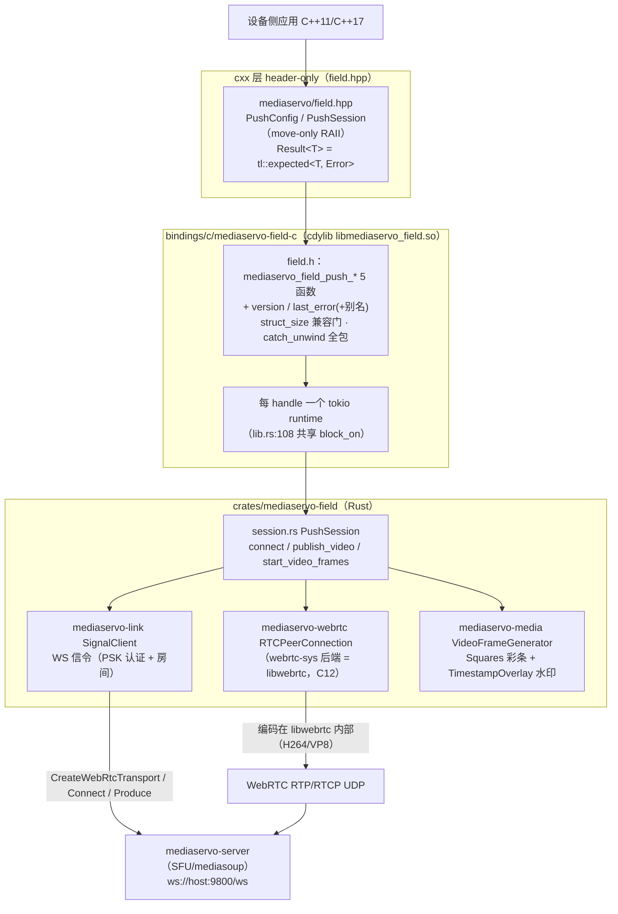
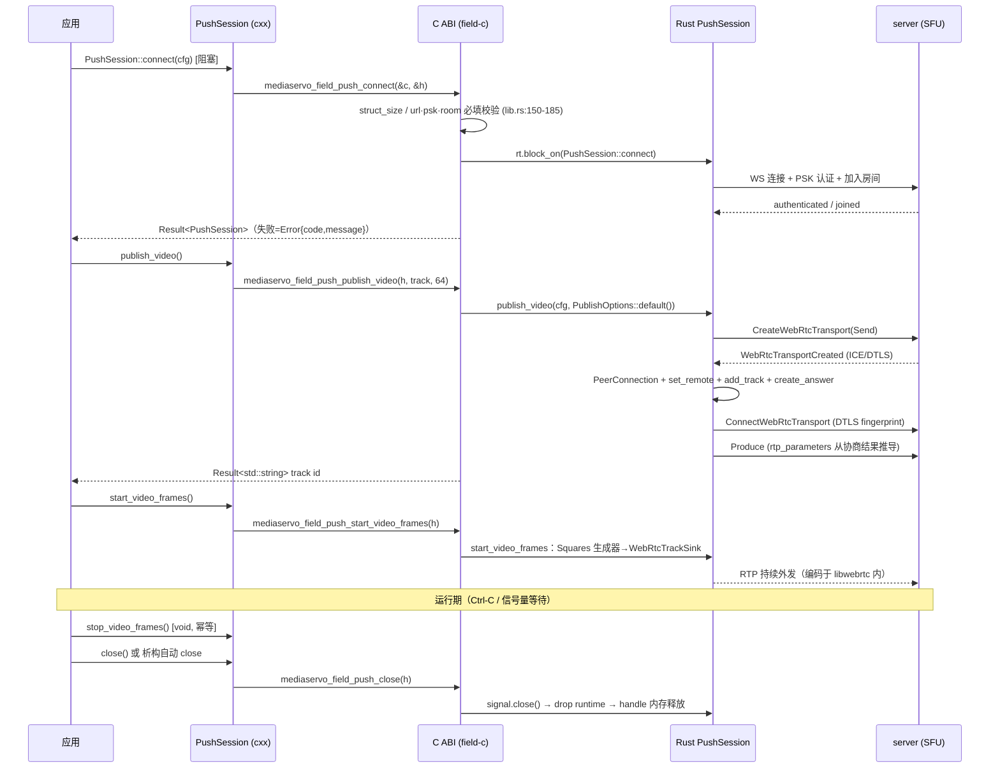

# MediaServo field C++ SDK 手册（设备侧推流闭环：信令 + WebRTC + 内置帧源）

> 状态: active · 2026-09-23 · 事实源 = `bindings/cxx/mediaservo-field-cxx/include/mediaservo/field.hpp`
> 与 `bindings/c/mediaservo-field-c/include/mediaservo/field.h`（7 主函数 + 1 deprecated 别名，本文逐名核对）
> 底层行为以 `bindings/c/mediaservo-field-c/src/lib.rs` 与 `crates/mediaservo-field/src/session.rs` 实测源码为准。

## 1. 定位与适用场景

`mediaservo::field`（C++ header-only RAII 绑定，over `mediaservo_field_*` C ABI，Rust 侧
`mediaservo-field` crate）是**组合 SDK：一条会话把"信令 + WebRTC 推流"闭环打包**——设备侧
（车端/相机端）连 mediaservo-server（或经 host-agent 本地网关），发布一路视频轨并持续推帧。

与兄弟 SDK 的边界（link=IPC 底座、deck=采集编解码工具箱、client=消费端）：

| 场景 | 用法 |
|------|------|
| 车端/设备推流到 SFU，舱端/浏览器拉流 | `PushSession::connect` → `publish_video` → `start_video_frames`（本 SDK 全部） |
| 演示/联调/占位流（Squares 彩条 + 时间戳水印） | `start_video_frames` 内置合成帧源，零外部输入即可出流 |
| 三方 C/C++ 设备接入 | C ABI（`field.h`）或本 header-only C++ 面，仅一个 .so 依赖 |

**不适用（本绑定面的真实边界，见 §8）**：注入真实相机帧（C/C++ 面无写帧 API，内置帧源为
合成 Squares；真帧推流走 Rust `mediaservo-field` 的 `video_sender()` 逃生舱或 host 二进制）、
拉流（Rust crate 有 `PullSession`，C/C++ 面未导出）、多路视频（Rust 侧 MVP 单轨限制，
session.rs:133-137）、控制 DataChannel（在 `mediaservo::client` / host controller 域）。

## 2. 原理与架构

三层：C++ RAII 薄层（header-only，零编译）→ C ABI 稳定面（opaque handle + int 错误码 +
struct_size 门）→ Rust `mediaservo-field` crate（依赖方向 `field → webrtc + link + deck`，
lib.rs:8，C21 单向无环）。每个 handle 内嵌一个共享 multi-thread tokio runtime
（worker_threads=2，lib.rs:129-135），全部 C 调用 `block_on` 同一实例——WS 读循环等后台任务
存活其上（审核 R1：per-call runtime 会在返回时取消任务导致会话死亡）。



要点（源码实证）：

- **编码器不是独立环节**：帧以 I420 喂入 `WebRtcTrackSink`（session.rs:339），编码由
  libwebrtc 按协商结果内部完成；码率/帧率经 `set_encoding_bitrate` /
  `set_encoding_framerate`（session.rs:222-229）配置。
- **协商走 answerer 路径**：server 侧 SDP 为 remote offer，本端 `create_answer`
  （session.rs:166-215，C18 官方路径）；codec 在 C 面固定 `PublishOptions::default()`
  = **vp8** + encoder_backend auto（config.rs:177-184，lib.rs:259）。
- **Rust 侧丰富配置未下沉 C 面**：`role`/`gateway_src`/`min_bitrate_kbps`/`degradation`/
  `content_hint`（config.rs:77-106）在 C/C++ 绑定不可设；C 面 connect 用
  `PushConfig::new`（role=Host、直连 server，config.rs:110-126）。
- **会话事件被 C 面丢弃**：Rust `connect` 返回 `(session, events)`，C 层解构为
  `Ok((session, _events))`（lib.rs:206）——断链/服务端错误对 C/C++ 消费者不可见（§8 悬案）。

## 3. 生命周期时序

调用顺序取自 `bindings/cxx/mediaservo-field-cxx/examples/vehicle_field.cpp`（全文）与
`bindings/c/mediaservo-field-c/examples/vehicle_push.c`（L14-73）。



## 4. API 清单

### 4.1 C ABI（`bindings/c/mediaservo-field-c/include/mediaservo/field.h`）

签名逐字抄录自头文件（行号=field.h）。错误约定：`mediaservo_err_t`（int），0=OK、<0=错误
（common.h:23-24）；错误详情经 `mediaservo_field_last_error` 读取。

| 函数 | 头文件行 | 语义 |
|------|---------|------|
| `mediaservo_err_t mediaservo_field_push_connect(const mediaservo_push_config_t* cfg, mediaservo_field_push_t** out)` | L69 | 连接信令+建会话（**阻塞**）。成功 `*out`=新 handle（调用方负责 close）；失败 `*out` 保持 null |
| `mediaservo_err_t mediaservo_field_push_publish_video(mediaservo_field_push_t* s, char* out_track, size_t out_track_len)` | L72 | 发布视频轨（阻塞协商）。track id 写入 `out_track`（建议 ≥64 字节；超长截断+NUL，lib.rs:263） |
| `mediaservo_err_t mediaservo_field_push_start_video_frames(mediaservo_field_push_t* s)` | L75 | 启动内置帧生成（Squares+时间戳水印）。须先 publish_video；重复调用=ERR_STATE |
| `void mediaservo_field_push_stop_video_frames(mediaservo_field_push_t* s)` | L78 | 停止帧生成（**幂等**，void 无错误通道；null handle 静默 no-op，lib.rs:328-330） |
| `mediaservo_err_t mediaservo_field_push_close(mediaservo_field_push_t* s)` | L81 | 关闭会话**并释放 handle**（null → OK，lib.rs:350；同指针二次调用=UB，见 §8-1） |
| `mediaservo_err_t mediaservo_field_last_error(char* buf, size_t len)` | L86 | 最近一次错误详情（进程级，§6.2；无错误时空串） |
| `mediaservo_err_t mediaservo_last_error(char* buf, size_t len)` | L89 | 上者的 **deprecated 别名**（additive-only 保留，新代码勿用） |
| `mediaservo_err_t mediaservo_field_version(char* buf, size_t len)` | L92 | SDK 版本 MAJOR.MINOR.PATCH（= crate 版本，现 0.1.1） |

**配置结构**（field.h:49-61）：

```c
typedef struct mediaservo_push_config_t {
    size_t struct_size;           /* 必填 sizeof(mediaservo_push_config_t)——ABI 兼容门 */
    const char* url;              /* WS 信令地址，如 "ws://host:9800/ws"（必填） */
    const char* psk;              /* PSK 认证密钥（必填） */
    const char* room;             /* 房间 ID（必填） */
    uint32_t width;               /* 视频宽 (默认 1280) */
    uint32_t height;              /* 视频高 (默认 720) */
    uint32_t framerate;           /* 帧率 (默认 30) */
    uint32_t bitrate_kbps;        /* 编码码率 kbps (默认 2000) */
    uint64_t keyframe_interval;   /* 关键帧间隔秒 (默认 2) */
} mediaservo_push_config_t;
#define MEDIASERVO_PUSH_CONFIG_DEFAULT { sizeof(mediaservo_push_config_t), NULL, NULL, NULL, 1280, 720, 30, 2000, 2 }
```

语义细节（lib.rs 实证）：`struct_size` 小于当前结构 → INVALID_ARG 并给出 rebuild 提示
（lib.rs:155-162）；大于（未来结构尾部追加）→ 忽略多余字节。width/height/framerate/
bitrate_kbps/keyframe_interval 填 **0 = 沿用 Rust 默认**（lib.rs:188-202）。字符串非 UTF-8 →
INVALID_ARG（lib.rs:181-184）。

**错误码**（field.h:33-37；历史无 FIELD 前缀别名 L39-43 同值保留）：

| 宏 | 值 | 触发（实现面） |
|----|----|---------------|
| `MEDIASERVO_FIELD_ERR_INVALID_ARG` | -1 | null 参数 / struct_size 过小 / 必填缺失 / 非法 UTF-8；cxx 已关闭会话调用 |
| `MEDIASERVO_FIELD_ERR_CONNECT` | -2 | 信令连接失败（WS/认证/入房） |
| `MEDIASERVO_FIELD_ERR_PUBLISH` | -3 | publish_video 协商/Produce 失败 |
| `MEDIASERVO_FIELD_ERR_STATE` | -4 | C 面：handle 已 closed 标志 / 未 publish 就 start / 重复 start（lib.rs:243-245, 293-295, 314） |
| `MEDIASERVO_FIELD_ERR_INTERNAL` | -5 | panic 兜底（catch_unwind）/ 锁中毒 |

**线程安全**：handle 契约为**单线程属主**（field.h:18）；实现内部 Mutex + `unsafe impl
Send/Sync`（lib.rs:113-116）允许跨线程传递但调用仍序列化于 Mutex，不承诺并发调用同一
handle 的语义。全部导出函数 panic 不越 FFI 边界（catch_unwind 包裹）。

### 4.2 C++ 层（`bindings/cxx/mediaservo-field-cxx/include/mediaservo/field.hpp`，header-only）

命名空间 `mediaservo::field`。`Result<T>` = `tl::expected<T, mediaservo::Error>`
（detail/result.hpp:48）——原生 API `has_value()/value()/error()/value_or()`，**无
operator bool**（result.hpp:4）；对 error 结果调 `value()` 抛
`tl::bad_expected_access<Error>`（result.hpp:5-6）。`Error{code, message, wire_code,
retryable}`，field 家族 `wire_code=0 / retryable=false` 恒置（result.hpp:28-32）。

```cpp
/// SDK 版本 (MAJOR.MINOR.PATCH)。                       // field.hpp:55
inline Result<std::string> version();

/// 推流配置（对应 mediaservo_push_config_t）。           // field.hpp:65
struct PushConfig {
    std::string url;  std::string psk;  std::string room;
    uint32_t width = 1280;  uint32_t height = 720;  uint32_t framerate = 30;
    uint32_t bitrate_kbps = 2000;  uint64_t keyframe_interval = 2;
};

/// 推流会话（move-only RAII；析构自动 close；默认构造 = 已关闭）。  // field.hpp:77
class PushSession {
public:
    static Result<PushSession> connect(const PushConfig& cfg);  // L80 阻塞，失败返回错误不抛异常
    PushSession() noexcept = default;                           // L100 = 已关闭会话
    ~PushSession();                                             // L101 (void)close()
    PushSession(const PushSession&) = delete;                   // L103 禁拷贝
    PushSession& operator=(const PushSession&) = delete;        // L104
    PushSession(PushSession&& other) noexcept;                  // L105
    PushSession& operator=(PushSession&& other) noexcept;       // L106 自赋值安全，先 close 旧值
    explicit operator bool() const noexcept;                    // L115 是否持有有效会话
    Result<std::string> publish_video();                        // L118 成功返回 track id
    Result<void> start_video_frames();                          // L129
    void stop_video_frames() noexcept;                          // L139 幂等，无错误通道
    Result<void> close() noexcept;                              // L144 置空 h_，重复调用返回 OK
};
```

RAII 语义（field.hpp 头注释 L4-9 + 实现）：默认构造/null handle 的所有方法**不触碰 C ABI**，
直接返回 `Error{MEDIASERVO_FIELD_ERR_INVALID_ARG, "closed"}`（L119, L130）；move 后源对象
变 null（`release_()`，L156-160）；析构对已 close/默认对象均安全。空字符串配置字段 →
传 nullptr 给 C（`c_str_or_null`，L44-46）→ C 面按必填拒绝。

## 5. 使用示例

### 5.1 C++ 完整推流（真实例，环境变量注入凭证）

来源：`bindings/cxx/mediaservo-field-cxx/examples/vehicle_field.cpp` L10-59（节选骨架，
逐行对应原文件；编译命令见该文件 L2-3 注释与 §7）。

```cpp
int main() {
    using mediaservo::field::PushConfig;
    using mediaservo::field::PushSession;

    // 配置从环境变量读取（禁止硬编码密钥/地址）
    const char* url = std::getenv("MEDIASERVO_SIGNAL_URL");
    const char* psk = std::getenv("MEDIASERVO_PSK");
    const char* room = std::getenv("MEDIASERVO_ROOM");
    if (!url || !psk || !room) {
        std::cerr << "set MEDIASERVO_SIGNAL_URL / MEDIASERVO_PSK / MEDIASERVO_ROOM\n";
        return 1;
    }

    PushConfig cfg;
    cfg.url = url;  cfg.psk = psk;  cfg.room = room;

    auto session = PushSession::connect(cfg);
    if (!session) {
        std::cerr << "connect failed: code=" << session.error().code
                  << " msg=" << session.error().message << "\n";
        return 1;
    }
    auto s = std::move(session).value();

    auto track = s.publish_video();
    if (!track) { std::cerr << "publish failed\n"; return 1; }
    std::cout << "published track: " << track.value() << "\n";

    auto started = s.start_video_frames();
    if (!started) { std::cerr << "start frames failed\n"; return 1; }

    std::cout << "pushing frames (Ctrl-C to stop)...\n";
    std::cin.get(); // 阻塞直到用户停止

    s.stop_video_frames();
    (void)s.close();
    return 0;
}
```

### 5.2 C ABI 等价流程

来源：`bindings/c/mediaservo-field-c/examples/vehicle_push.c` L14-73（该例硬编码
`ws://127.0.0.1:9800/ws` 为开发值，生产按头注释 L8-16 用法自行注入）。

```c
mediaservo_push_config_t cfg = MEDIASERVO_PUSH_CONFIG_DEFAULT;
cfg.url = "ws://127.0.0.1:9800/ws";  cfg.psk = "mediaservo-dev";  cfg.room = "vehicle-c";

mediaservo_field_push_t* s = NULL;
char err[256];
if (mediaservo_field_push_connect(&cfg, &s) != MEDIASERVO_OK) {
    mediaservo_field_last_error(err, sizeof(err));
    fprintf(stderr, "connect failed: %s\n", err);
    return 1;
}
char track[64];
mediaservo_field_push_publish_video(s, track, sizeof(track));   /* 每步 rc 检查略，见原文件 */
mediaservo_field_push_start_video_frames(s);
/* ... 运行 ... */
mediaservo_field_push_stop_video_frames(s);
mediaservo_field_push_close(s);   /* 此后 s 悬垂，不得再用（§8-1） */
```

### 5.3 错误路径 / RAII 语义回归锚（测试即文档）

来源：`bindings/cxx/mediaservo-field-cxx/tests/test_field.cpp`——5 个用例：
version 前缀（L15-19）、空配置快速 INVALID_ARG 不触网（L21-28）、`value()` 误用抛
`bad_expected_access`（L30-40）、已关闭会话各方法行为（L42-58：publish/start=INVALID_ARG
+"closed"、stop no-op、close 幂等 OK）、move 语义（L60-70）。

## 6. 错误与边界

### 6.1 错误通道三层形

1. **C**：返回值 `<0` + `mediaservo_field_last_error` 读详情（每次 C 调用失败时覆盖写）。
2. **C++**：`Result<T>`（非异常）；`detail::make_error(code)` 在 C 返回 <0 后自动读
   last_error 组装 `Error{code, message}`（field.hpp:37-41，buf 512B）。
3. **异常仅一处**：误用 `value()/error()` 抛 `tl::bad_expected_access<Error>`——
   这是编程错误信号，不是运行时错误通道（livekit Result 模式一致，field.hpp:8-9）。

### 6.2 last_error = 进程级全局（非线程局部、非 per-handle）

实现为 `static LAST_ERROR: Mutex<Option<String>>`（lib.rs:48）。**线程安全**指并发读写不
data race（Mutex 序列化）；但语义是**全进程最近一次错误**：多线程/多 handle 场景下，A 线程
读到的可能是 B 线程刚写的错误。可靠模式：调用失败后**立即**同线程读 message（cxx 层
make_error 即此形）。Rust 测试面因此全文件串行（TEST_LOCK，lib.rs:424-429）——消费方同理
勿依赖 last_error 做并发归因。

### 6.3 struct_size ABI 门（R3）

`cfg.struct_size` 必须 `>= sizeof(mediaservo_push_config_t)`（当前结构），旧头编译的调用方
得到明确 INVALID_ARG + "rebuild with current header" 文案（lib.rs:155-162）；超大值（未来
结构演进）忽略尾部。MAJOR 内只加字段不改语义（D241，field.h:3）。cxx 层由
`MEDIASERVO_PUSH_CONFIG_DEFAULT` 初始化自动填正确（field.hpp:81）。

### 6.4 其他边界

- **阻塞语义**：connect/publish_video 阻塞至信令往返完成；start/stop/close 仅本地操作
  （start 注释 lib.rs:282"阻塞仅本地启动"）。无超时参数——server 不可达时的挂起行为取决于
  底层 WS 连接阶段（未设显式超时，device-day 观察项）。
- **单视频轨**：第二次 `publish_video` 返回 ERR_PUBLISH（Rust 侧 InvalidState"已存在 active
  track"，session.rs:133-137）。
- **start 前置**：未 publish 就 start → ERR_STATE（"publish_video first"，session.rs:318）。
- **close 后**：C 面其余调用为 UB（handle 内存已释放，见 §8-1）；cxx 面因置空 h_ 而安全。
- **panic 不跨界**：所有 C 入口 catch_unwind → ERR_INTERNAL（lib.rs 各函数尾）。

## 7. 构建与链接

前置：cdylib 已构建（`pixi run build-c` → `target/debug/libmediaservo_field.so` +
`.so.0` dev symlink，test-cxx.sh L4 注释）。

### 7.1 仓内直编（四 SDK 统一形，摘自 scripts/test-cxx.sh L13-18）

```bash
g++ -std=c++11 -Wall -Wextra \
    -I bindings/cxx/mediaservo-field-cxx/include -I bindings/cxx/include \
    -I bindings/c/mediaservo-field-c/include -I bindings/c/include \
    bindings/cxx/mediaservo-field-cxx/tests/test_field.cpp \
    -L target/debug -lmediaservo_field -o /tmp/opencode/test_field_cxx
LD_LIBRARY_PATH=target/debug /tmp/opencode/test_field_cxx
```

C++11 起步（Result 用 tl::expected，无 C++17 依赖）；`bindings/cxx/include` 提供共享
`detail/result.hpp` + vendored `tl/expected.hpp`。C 例同形（vehicle_push.c L3-6 注释）。
回归入口：`bash scripts/test-cxx.sh`（field/link/deck/client 四 SDK + common-cxx 契约）。

### 7.2 交付树消费（out/bindings / sdk-field 包）

`./msrtc.sh build bindings`（或子模块 `mediaservo.sh build bindings` / `deploy bindings`）
组装 `out/bindings/`：`include/mediaservo/{field.h,field.hpp,common.h,detail/,3rdparty/}`
（mediaservo_cli.py L412-426 逐 sdk 拷 `.h`/`.hpp`）、`lib/libmediaservo_field.so.<major>`、
`lib/pkgconfig/mediaservo-field.pc`、`lib/cmake/mediaservo/mediaservoConfig.cmake`。

```cmake
find_package(mediaservo REQUIRED COMPONENTS field)   # D248 发现面
target_link_libraries(app PRIVATE mediaservo::field)
```

```bash
pkg-config --cflags --libs mediaservo-field   # -I${prefix}/include -L${prefix}/lib -lmediaservo_field
```

.pc 模板：`bindings/c/mediaservo-field-c/mediaservo-field.pc.in`（`${pcfiledir}` 可重定位）。
发布包归属：**field 在 sdk-field 包**（设备半区，`sdk_list = "field link deck"`）；
sdk-client 包组装时 field 的 h/hpp/pc/.so 被显式摘除（mediaservo_cli.py L1233-1245）——
舱端消费方不需要本 SDK。

## 8. 已知坑 / FAQ / 悬案清单

1. **C 面 close"幂等"仅对 null 指针成立**（头注释 vs 实现差异，field.h:81 vs lib.rs:353）：
   `mediaservo_field_push_close` 第一步 `Box::from_raw(s)` 收回所有权，函数返回时 handle
   内存**已释放**；同一指针二次 close 是对悬垂指针的 `Box::from_raw` = double-free UB。
   内部 `closed.swap` 标志只防"close 后再调其他 API"路径，防不了二次 close 本身。
   **正确姿势**：C 面 close 后立刻 `s = NULL`；或直接用 cxx `PushSession`（close 置空 h_，
   析构/重复 close 均安全——test_field.cpp L56-57、L69 为该语义的回归锚）。
2. **无事件通知面**：Rust 会话有 `SessionEvents`（断链/服务端错误升格为 SessionEvent::Error，
   session.rs:86-110），C 层直接丢弃 `_events`（lib.rs:206）。C/C++ 消费者在
   `start_video_frames` 之后**感知不到断链**——推流侧需自备健康检查（拉流端 bytes 判活，
   或 server admin API），断链重连=重建整个会话。回调面导出为潜在演进项（未立项）。
3. **codec 不可选**：C 面 publish_video 固定 `PublishOptions::default()` → **VP8**
   （lib.rs:259 + config.rs:180）。想推 H264 需走 Rust crate 或等 C 面扩参（struct_size
   门已为尾部加字段铺路）。
4. **内置帧源是合成流**：`start_video_frames` = Squares 彩条 + 时间戳水印
   （session.rs:326-345），非真实相机采集。接真实视频源在本绑定面**没有 API**——
   Rust 侧逃生舱是 `video_sender()` + `write_raw_i420_with_ts`（session.rs:306-309，
   host-streamer 消费形）；C/C++ 消费方需要真帧时评估直接用 host 二进制或提 C 面扩参需求。
5. **last_error 进程级共享**（§6.2）：多 handle/多线程并发失败时错误详情互相覆盖；
   code 返回值本身可靠，message 只作诊断参考。
6. **每 handle 一个 tokio runtime（2 worker 线程）**：多路推流=多 handle=线程数线性涨；
   车端单会话场景无感，密集网关场景注意（升级路径=共享 runtime，未立项）。
7. **Rust 文档注释陈旧形**：lib.rs:16 模块注释里 publish_video 签名写作
   `mediaservo_track_id_t* out_track`，与现行头文件（`char*, size_t`，field.h:72）不符——
   以头文件为准（手工维护的 field.h 是导出面事实源）。
8. **版本面**：`mediaservo_field_version` 返回 mediaservo-field-c 的 CARGO_PKG_VERSION
   （lib.rs:412）= workspace 继承值（现 0.1.1）；交付 crate mediaservo-field 独立版本源
   （F12/V1a，crates/mediaservo-field/Cargo.toml:3）——两者当前同值但**语义上独立**，
   勿以 C 面版本推断 Rust crate 版本。
9. **悬案（待核实）**：C 面 connect 无显式超时参数，server 半可达（TCP 通、WS 握手挂）
   场景的阻塞上限未实测钉住；device-day/弱网矩阵复跑时补测（weaknet degraded profile
   现成）。

---

### 附：事实源清单（本文全部符号的 grep 锚）

| 面 | 文件 | 关键行 |
|----|------|--------|
| C 头 | bindings/c/mediaservo-field-c/include/mediaservo/field.h | 函数 L69/72/75/78/81/86/89/92；结构 L49-61；错误码 L33-43 |
| C 实现 | bindings/c/mediaservo-field-c/src/lib.rs | connect L145 / publish L232 / start L284 / stop L326 / close L348 / last_error L393 / 别名 L400 / version L407；LAST_ERROR L48；runtime L129 |
| C++ 头 | bindings/cxx/mediaservo-field-cxx/include/mediaservo/field.hpp | version L55 / PushConfig L65 / PushSession L77-162 |
| Result | bindings/cxx/include/mediaservo/detail/result.hpp | Error L33-43 / Result L48 |
| Rust 行为 | crates/mediaservo-field/src/session.rs · config.rs · sfu.rs | PushSession L60-370 / PublishOptions L170-184 / codec_spec sfu.rs:22 |
| 例/测 | test_field.cpp（cxx）· vehicle_field.cpp（cxx）· vehicle_push.c（c） | §5 各引用 |
| 构建 | scripts/test-cxx.sh · mediaservo-field.pc.in · scripts/mediaservo_cli.py L412-426/L1233-1254 | §7 |
