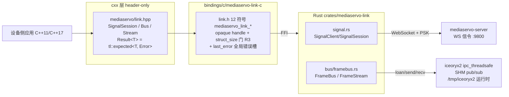
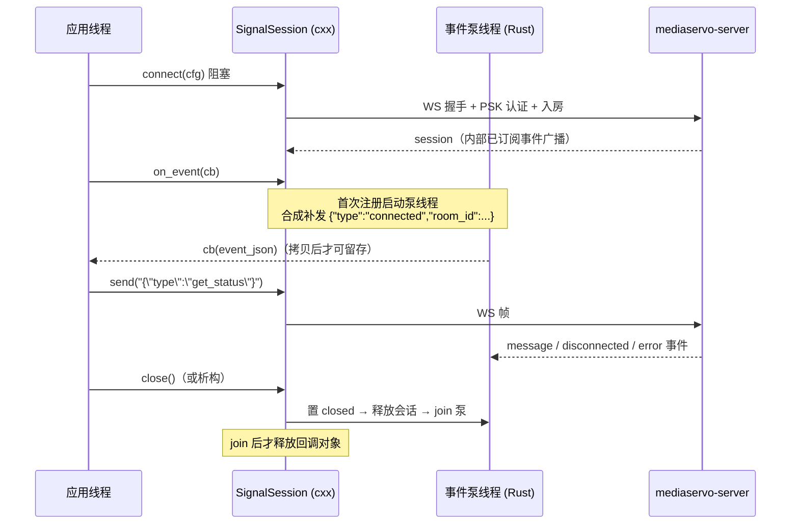
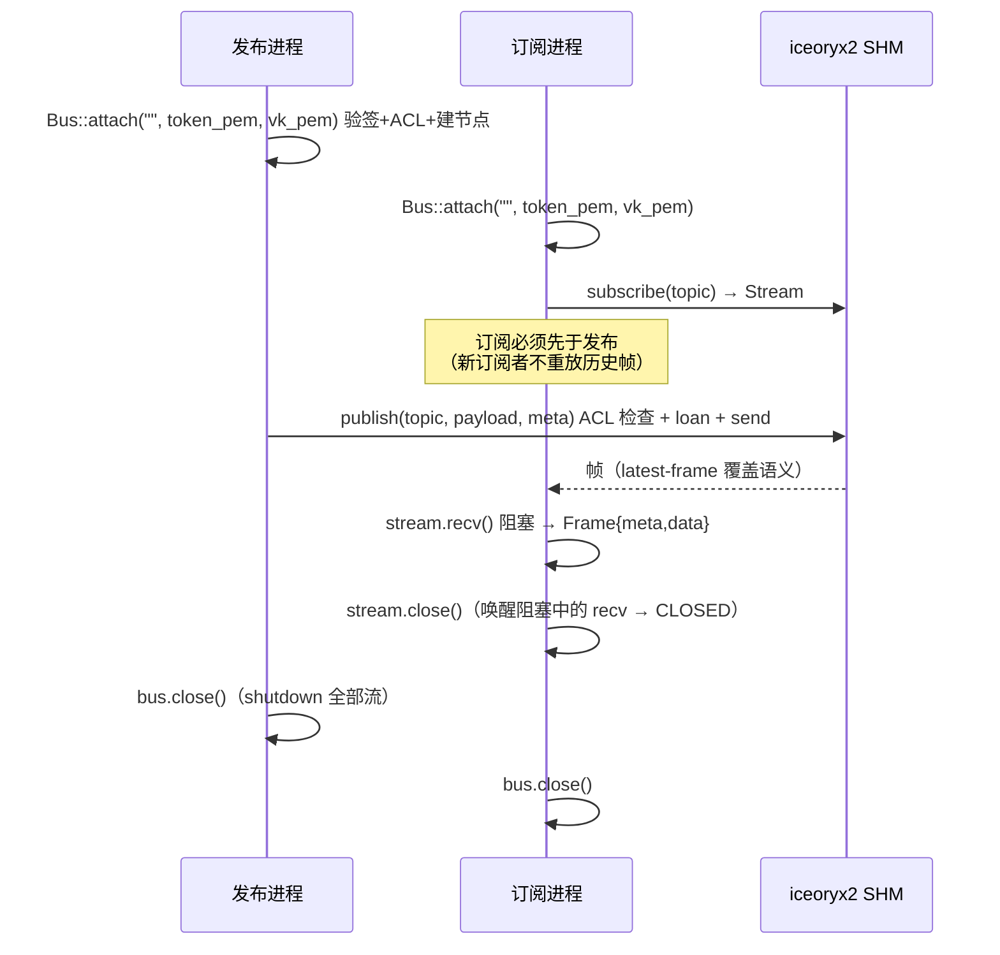

# MediaServo link C++ SDK 手册（设备侧 IPC：信令 + 帧总线）

> 状态: active · 2026-09-23 · 事实源 = `bindings/cxx/mediaservo-link-cxx/include/mediaservo/link.hpp`
> 与 `bindings/c/mediaservo-link-c/include/mediaservo/link.h`（12 函数 C 面，本文逐名核对）

## 1. 定位与适用场景

`mediaservo::link`（C++ header-only RAII 绑定，over `mediaservo_link_*` C ABI）是**设备侧
IPC SDK**，覆盖两条独立能力：

- **信令会话**（`SignalSession`）：WebSocket 连 mediaservo-server（默认 :9800 `/ws`），
  PSK 认证 + 房间收发 `SignalingMessage`（JSON）。
- **帧总线**（`Bus` / `Stream`）：iceoryx2 共享内存 FrameBus 的进程间 publish/subscribe，
  Ed25519 能力令牌（JWT）验签 + ACL 裁决，同机多进程零拷贝传帧（如 host-agent → host-streamer）。

典型场景：

| 场景 | 用法 |
|------|------|
| 车端/设备推流侧信令 | `SignalSession::connect`（role=Pusher）→ `on_event` 事件泵 → `send` |
| 同机帧分发 | 采集进程 `Bus::publish` → 编码/推流进程 `Bus::subscribe` + `Stream::recv` |
| 三方设备接入 | 直接用 C ABI（`link.h`），或本 header-only C++ 面 |

不适用：网络媒体传输（WebRTC/SFU 消费在 `mediaservo::client`）、编解码/采集（`mediaservo::deck`、
`mediaservo::field`）。link 只管"信令到 server"与"帧在同机进程间"。

## 2. 原理与架构

三层结构：C++ RAII 薄层（header-only，零编译）→ C ABI 稳定面（12 符号，`extern "C"`）→
Rust `mediaservo-link` crate（cdylib `libmediaservo_link.so`）。



要点（均出自头文件/实现契约注释）：

- **命名空间** `mediaservo::link`；错误类型复用 `mediaservo::Error` / `mediaservo::Result`
  （`bindings/cxx/include/mediaservo/detail/result.hpp`，D248 单一事实源）。
- **生命周期契约**（link.hpp 头注释，自 C ABI 翻译成 RAII）：`SignalSession`/`Bus`/`Stream`
  均 move-only；析构自动 close（幂等）；默认构造 = 已关闭（null handle），对已关闭对象调
  API 返回 `Error{INVALID_ARG, "closed"}`，**不触碰 C ABI**。
- **事件回调**在内部泵线程触发；`std::function` 堆对象在 close（join 泵线程）后统一释放，
  防 use-after-free；回调内禁止调用 close/on_event（C 契约 = UB）。
- **错误通道为 Result（非异常）**；误用 `value()`/`error()` 抛
  `tl::bad_expected_access<Error>`（std::exception 子类，细节经 `.error().code/.message`）。
- C ABI 侧 `close(NULL)` 幂等返回 OK；handle 单线程属主，close 后再调任何 API 为 UB
  （link.h 生命周期契约 R2）。

## 3. 生命周期时序

### 3.1 信令（connect → on_event → send → close）



### 3.2 帧总线（双进程：发布端 + 订阅端）



## 4. API 一览（签名逐字抄自 link.hpp / link.h）

### 4.1 C++ 自由函数与配置

| 签名（link.hpp 原文） | 语义 |
|---|---|
| `inline Result<std::string> version()` | SDK 版本 `MAJOR.MINOR.PATCH`（= mediaservo-link crate 版本） |
| `struct SignalConfig { std::string url; std::string psk; std::string room; std::string role; }` | `role`: `"Host"/"Pusher"` → Host，`"Client"/"Puller"` → Remote；**空串 = Host**（C 侧 NULL 同义） |

### 4.2 `class SignalSession`（move-only RAII）

| 签名（原文） | 语义 |
|---|---|
| `static Result<SignalSession> connect(const SignalConfig& cfg)` | 连接信令 + 创建会话（阻塞；失败返回错误，不抛异常）。url/psk/room 必填（cxx 空串→C NULL→`INVALID_ARG`）；role 非法值 → `INVALID_ARG`；连接失败 → `CONNECT` |
| `SignalSession() noexcept = default` | 默认构造 = 已关闭 |
| `~SignalSession()` | 析构自动 `(void)close()` |
| `SignalSession(const SignalSession&) = delete` / `operator=(const SignalSession&) = delete` | 禁拷贝 |
| `SignalSession(SignalSession&& other) noexcept` / `operator=(SignalSession&&)` | move 后源对象 = 已关闭 |
| `explicit operator bool() const noexcept` | 是否持有有效会话 |
| `Result<void> send(const std::string& json)` | 发送一条信令消息（JSON；SignalingMessage type 标签 snake_case）。空串 → C 侧 `INVALID_ARG`；JSON 解析失败 → `SEND`；已关闭对象 → `Error{INVALID_ARG,"closed"}` |
| `void on_event(std::function<void(const std::string&)> cb)` | 注册事件回调（connect 后任意时刻；重复注册替换；回调在内部泵线程触发，事件串仅在回调内有效，需保留请拷贝；回调内禁止调用本对象任何方法）。已关闭对象 = no-op |
| `Result<void> close() noexcept` | 关闭会话并释放 handle（幂等；join 事件泵后才释放回调对象） |

### 4.3 `class Bus`（move-only RAII）

| 签名（原文） | 语义 |
|---|---|
| `static Result<Bus> attach(const std::string& endpoint, const std::string& token_pem, const std::string& vk_pem)` | 附加帧总线（验签 + ACL + iceoryx2 节点，阻塞）。`endpoint` 为 Phase 1 预留（**空串即可但必须传参**——C++ 面传 `std::string`，C 面 NULL 会被拒）。`token_pem` = Ed25519 能力令牌 **JWT 字符串**（实现：`CapabilityToken::from_raw`，命名有误导性）；`vk_pem` = Ed25519 验证密钥 PEM。验签/建节点失败 → `BUS` |
| `Bus() noexcept = default` / `~Bus()` / 拷贝 delete / move 两式 / `explicit operator bool()` | 同 SignalSession 惯例 |
| `Result<void> publish(const std::string& topic, const std::vector<uint8_t>& payload, const mediaservo_frame_meta_t& meta)` | 发布一帧（ACL 检查 + SHM loan + send，阻塞）。空 payload 时 C 侧按 `NULL + len==0` 传（纯元数据帧合法）。meta.version 非 WIRE_VERSION(=0) → C 侧 `INVALID_ARG`（"invalid meta"） |
| `Result<class Stream> subscribe(const std::string& topic)` | 订阅 topic 创建帧流（阻塞）。失败 → `BUS` |
| `Result<void> close() noexcept` | 关闭总线（幂等；shutdown 全部流，stream recv 返回 CLOSED） |

### 4.4 `struct Frame` 与 `class Stream`（move-only RAII）

| 签名（原文） | 语义 |
|---|---|
| `struct Frame { mediaservo_frame_meta_t meta{}; std::vector<uint8_t> data; }` | 一帧（元数据 + 载荷拷贝） |
| `Stream() noexcept = default` / `~Stream()` / 拷贝 delete / move 两式 / `explicit operator bool()` | 同上惯例；仅 `Bus::subscribe` 可造（构造 private，`friend class Bus`） |
| `Result<Frame> recv()` | 阻塞取帧（元数据 + 载荷拷贝）。内部单缓冲 **16 MiB**（覆盖 4K I420 = 12.4 MiB）；C ABI 无法探测截断，更大帧会静默截到 cap。关停后 → `CLOSED`；已关闭对象 → `Error{INVALID_ARG,"closed"}` |
| `Result<void> close() noexcept` | 关闭帧流（幂等；唤醒阻塞中的 recv 使其返回 CLOSED） |

### 4.5 C ABI 面（link.h，12 函数；C++ 层逐一对应）

```c
mediaservo_err_t mediaservo_link_signal_connect(const mediaservo_link_signal_config_t* cfg, mediaservo_link_signal_t** out);
mediaservo_err_t mediaservo_link_signal_send(mediaservo_link_signal_t* s, const char* msg_json, size_t len);
void             mediaservo_link_signal_on_event(mediaservo_link_signal_t* s, mediaservo_link_event_cb cb, void* user);
mediaservo_err_t mediaservo_link_signal_close(mediaservo_link_signal_t* s);
mediaservo_err_t mediaservo_link_bus_attach(const char* endpoint, const char* token_pem, const char* vk_pem, mediaservo_link_bus_t** out);
mediaservo_err_t mediaservo_link_bus_publish(mediaservo_link_bus_t* b, const char* topic, const uint8_t* payload, size_t len, const mediaservo_frame_meta_t* meta);
mediaservo_err_t mediaservo_link_bus_subscribe(mediaservo_link_bus_t* b, const char* topic, mediaservo_link_stream_t** out);
mediaservo_err_t mediaservo_link_bus_recv(mediaservo_link_stream_t* st, mediaservo_frame_meta_t* out_meta, uint8_t* out_data, size_t cap, size_t* out_len);
mediaservo_err_t mediaservo_link_stream_close(mediaservo_link_stream_t* st);
mediaservo_err_t mediaservo_link_bus_close(mediaservo_link_bus_t* b);
mediaservo_err_t mediaservo_link_last_error(char* buf, size_t len);
mediaservo_err_t mediaservo_link_version(char* buf, size_t len);
```

C 面差异注：`signal_on_event` 的 `cb = NULL` 为**取消注册**（仅 C 面；C++ 未暴露）；
C 面对已 close（置 closed 标志）的 handle 调用返回 `STATE`/`CLOSED`，而 C++ 已关闭对象
本地短路返回 `INVALID_ARG,"closed"`；`bus_recv` 的 `out_data`/`cap` 在 C 面要求非 NULL 且
`cap > 0`。

### 4.6 共享类型（common.h / result.hpp）

| 项 | 说明 |
|---|---|
| `struct Error { int code; std::string message; uint16_t wire_code; bool retryable; }` | link 面 `wire_code`/`retryable` **恒 0/false**（client 家族专用机读位，S6 批1b） |
| `template <typename T> using Result = tl::expected<T, Error>` | 原生 API：`has_value()/value()/error()/value_or()` |
| `mediaservo_frame_meta_t` | 36B 字段袋（`#pragma pack(1)`，LE）：`seq(8) width(4) height(4) format(1) version(1) is_keyframe(1) reserved(1) ts_mono_ns(8) ts_epoch_ns(8)`；`format`: 0=未知 1=I420 2=NV12 3=RGBA；`version` 必须 = 0（WIRE_VERSION，N4 拒未知）；`reserved` 必须填 0；编译期尺寸断言 36B |
| `MEDIASERVO_LINK_SIGNAL_CONFIG_DEFAULT` | `{ sizeof(mediaservo_link_signal_config_t), NULL, NULL, NULL, NULL }`——C 面初始化宏（struct_size 门） |

## 5. 使用示例

### 5.1 信令全链（真实代码，节选自示例程序）

```cpp
SignalConfig cfg;
cfg.url = url;                       // 环境变量读取（禁止硬编码密钥/地址）
cfg.psk = psk;
cfg.room = room;
cfg.role = "Pusher";                 // 车端推流角色

auto result = SignalSession::connect(cfg);
if (!result) {
    std::cerr << "connect failed: code=" << result.error().code
              << " msg=" << result.error().message << "\n";
    return 1;
}
auto session = std::move(result).value();

session.on_event([](const std::string& event_json) {
    std::cout << "event: " << event_json << "\n"; // 事件串仅在回调内有效（已拷贝）
});

auto sent = session.send("{\"type\":\"get_status\"}");
if (!sent) {
    std::cerr << "send failed: code=" << sent.error().code
              << " msg=" << sent.error().message << "\n";
    return 1;
}
```

> 来源：`bindings/cxx/mediaservo-link-cxx/examples/vehicle_link.cpp`（完整程序含
> `std::getenv` 配置读取与 `session.close()` 收尾；需运行中 server 才能全流程跑通）。

### 5.2 错误路径与已关闭语义（真实测试代码）

```cpp
// 空配置 → C ABI 快速 INVALID_ARG（url/psk/room 必填），不触网
auto r = SignalSession::connect(SignalConfig{});
assert(!r.has_value());
assert(r.error().code == MEDIASERVO_LINK_ERR_INVALID_ARG);
assert(!r.error().message.empty());

SignalSession s;                     // 默认构造 = 已关闭
assert(!s);
auto send = s.send("{\"type\":\"ping\"}");
assert(send.error().code == MEDIASERVO_LINK_ERR_INVALID_ARG);
assert(send.error().message == "closed");
s.on_event([](const std::string&) {}); // 已关闭 no-op，不崩
assert(s.close().has_value());       // 幂等
assert(s.close().has_value());

// 空 token/vk → JWT 验签快速失败（BUS 错误，不建 iceoryx 节点）
auto b = Bus::attach("", "", "");
assert(b.error().code == MEDIASERVO_LINK_ERR_BUS);
```

> 来源：`bindings/cxx/mediaservo-link-cxx/tests/test_link.cpp`（另含 `version()` 前缀
> 断言 `"0.1."`、Result 误用抛 `tl::bad_expected_access<Error>`、三类句柄 move 语义测试）。

### 5.3 帧总线 publish/subscribe（cxx 形假代码——仓内无 cxx bus 示例，按 §5.2 同款
### API 从 C 单测转写，未编译验证）

```cpp
// 假代码（未编译验证）：语义锚 = bindings/c/mediaservo-link-c/src/lib.rs
// 单测 bus_attach_publish_subscribe_recv_roundtrip（双节点 token/ACL、订阅先于发布）。
Bus publisher = Bus::attach("", token_pem_capture, vk_pem).value();
Bus subscriber = Bus::attach("", token_pem_processor, vk_pem).value();

Stream st = subscriber.subscribe("camera/ct/front/raw").value(); // 订阅先于发布

mediaservo_frame_meta_t meta{};
meta.seq = 7; meta.width = 640; meta.height = 480; meta.format = 1; // I420
meta.version = 0;              // WIRE_VERSION，非 0 会被 publish 拒（INVALID_ARG）
meta.is_keyframe = 1; meta.reserved = 0;
meta.ts_mono_ns = 1000; meta.ts_epoch_ns = 2000;
std::vector<uint8_t> payload(64, 0xAA);
publisher.publish("camera/ct/front/raw", payload, meta).value();

Frame f = st.recv().value();   // 阻塞；meta/payload 为拷贝
assert(f.meta.seq == 7 && f.data == payload);
st.close();                    // 唤醒他线程阻塞中的 recv → CLOSED
```

> C 面正向链路（已验证）在 `bindings/c/mediaservo-link-c/src/lib.rs` 的
> `bus_attach_publish_subscribe_recv_roundtrip`：Capture 节点仅发布 `camera/*`、
> Processor 仅订阅 `camera/*`（ACL 矩阵），双 token 由测试密钥对签发。

## 6. 错误与边界语义

### 6.1 错误码（link.h；0 = OK，<0 = 错误）

| 宏 | 值 | 触发（实测于 lib.rs） |
|---|---|---|
| `MEDIASERVO_LINK_ERR_INVALID_ARG` | -1 | null/缺参/struct_size 过小/非法 UTF-8/role 未知/空消息；**C++ 已关闭对象本地短路** |
| `MEDIASERVO_LINK_ERR_CONNECT` | -2 | WS 连接/认证/入房失败 |
| `MEDIASERVO_LINK_ERR_SEND` | -3 | send JSON 解析失败或发送失败 |
| `MEDIASERVO_LINK_ERR_BUS` | -4 | bus_attach 验签失败 / publish / subscribe / bus_close 的总线侧错误 |
| `MEDIASERVO_LINK_ERR_STATE` | -5 | C 面对已 close（closed 标志）handle 调 send/publish/subscribe |
| `MEDIASERVO_LINK_ERR_INTERNAL` | -6 | Rust panic 兜底（catch_unwind）/ 锁中毒 |
| `MEDIASERVO_LINK_ERR_CLOSED` | -7 | recv 时流/总线已关停 |

### 6.2 last_error 通道

- C 面：每次 `<0` 返回可用 `mediaservo_link_last_error(buf, len)` 读详情；实现为**进程级全局
  `static LAST_ERROR`（Mutex）**——头注释"线程安全"指读写不竞破，**不是 per-thread 语义**；
  并发调用方互相覆写（C 单测为此整文件 TEST_LOCK 串行，PIT-205 族）。
- C++ 面：`detail::make_error` 在每次 C 调用失败后**立即**把 message 拷进 `Error`，正常消费
  `result.error().message` 即可，无需也不应再调 last_error。

### 6.3 struct_size 门（R3，仅 C 面 config）

`mediaservo_link_signal_config_t.struct_size` 必须 `>= sizeof(库已知结构)`，超长忽略——
结构加字段不破坏二进制兼容（D241：MAJOR 内只加法）。旧头文件编译的调用方传小值 →
`INVALID_ARG`（last_error 提示 "rebuild with current header"）。C++ 包装自动填，无感。

### 6.4 事件 JSON（opaque v1，link.h 头注释）

`{"type":"connected","room_id":...}` / `{"type":"message","message":{...SignalingMessage}}` /
`{"type":"disconnected","reason":...}` / `{"type":"error","error":...}`。
注册回调前发生的事件可能丢失；首次注册时泵**合成补发 connected**。广播溢出（Lagged）时
泵跳过丢弃继续（事件会漏，媒体帧面不受影响）。

## 7. 构建与链接

### 7.1 CMake（发布树，D248 单包多组件，OpenCV/Boost 模式）

```cmake
find_package(mediaservo COMPONENTS link REQUIRED)   # -DCMAKE_PREFIX_PATH=<sdk 安装前缀>
target_link_libraries(app PRIVATE mediaservo::link)
```

`mediaservo::link` 为 INTERFACE imported target：include 目录 `<prefix>/include` +
链接 `<prefix>/lib/libmediaservo_link.so`。组件名校验：未知 COMPONENTS 直接
`FATAL_ERROR`；版本兼容由 `mediaservoConfigVersion.cmake`（SameMajorVersion 语义，
`mediaservo_SDK_ABI_MAJOR`）自动裁决。

### 7.2 pkg-config

```bash
pkg-config --cflags --libs mediaservo-link   # -I${prefix}/include -L${prefix}/lib -lmediaservo_link
```

`.pc` 用 `${pcfiledir}` 推导前缀，可重定位（不绑定绝对安装路径）。

### 7.3 仓内直接编译（test-cxx.sh 实形，C++11 起步）

```bash
export LD_LIBRARY_PATH="$PWD/target/debug"           # 跑前必设（或 rpath）
g++ -std=c++11 -Wall -Wextra \
    -I bindings/cxx/mediaservo-link-cxx/include -I bindings/cxx/include \
    -I bindings/c/mediaservo-link-c/include -I bindings/c/include \
    bindings/cxx/mediaservo-link-cxx/tests/test_link.cpp \
    -L target/debug -lmediaservo_link -o /tmp/test_link_cxx
```

> 来源：`scripts/test-cxx.sh`（四 SDK 循环之一；前置 `pixi run build-c` 产出三 cdylib +
> dev `.so.<MAJOR>` symlink）。

### 7.4 out/bindings 交付树（`./mediaservo.sh build bindings` 组装）

```
out/bindings/
├── lib/
│   ├── libmediaservo_link.so.0.1.x   # 实体（SONAME 文件名，D241 三件套）
│   ├── libmediaservo_link.so.0       # → soname 符号链接
│   ├── libmediaservo_link.so         # → 开发链接符号链接
│   ├── pkgconfig/mediaservo-link.pc
│   └── cmake/mediaservo/{mediaservoConfig,mediaservoConfigVersion}.cmake
└── include/mediaservo/
    ├── common.h  link.h              # C 面
    ├── link.hpp                      # cxx 面（另含 field/deck/client.hpp）
    └── detail/ 3rdparty/             # result.hpp + tl::expected
```

`version()` 返回的 `MAJOR.MINOR.PATCH` 即本 crate 版本（C43：交付 crate 独立版本源）；
soname MAJOR（`.so.0`）= ABI 代际，MAJOR 内只加法。

## 8. 已知坑 / FAQ（均经代码核实）

1. **每 topic 订阅者上限 32**（`MAX_SUBSCRIBERS_PER_TOPIC`，
   `crates/mediaservo-link/src/bus/framebus.rs:14`）。09-20 事故：iceoryx2 默认 8 时
   8 路流共享单 topic 顶格、确定性失败。**上限在服务创建时定死**且服务元数据持久于
   `/tmp/iceoryx2/services`——旧上限跨 restart 存活，升级后需清运行时目录重建（见下条）。
2. **iceoryx2 残留运行时目录**：`/tmp/iceoryx2`（nodes/services）+ `/dev/shm/iox2_*`。
   僵尸节点占订阅槽、残留 service 状态导致 subscribe/open 持久 `SystemInFlux`（重试无效）。
   恢复处方（C25）：`stop → rm -rf /tmp/iceoryx2 /dev/shm/iox2_* → start`。Rust 侧对
   `open_or_create` 的 SystemInFlux **瞬态**有重试，但跨 run 残留属持久态，重试救不了。
3. **订阅先于发布、历史帧不重放**：iceoryx2 新订阅者只收订阅之后的样本；服务配置
   `buffer_size=1 + enable_safe_overflow(true)` = **latest-frame 覆盖语义**（慢消费者只留
   最新帧），`max_publishers(1)` 单发布者由 iceoryx2 强制（D239）——同 topic 第二个发布端
   `publish` 报 `BUS`。
4. **topic 命名**：斜杠分层字符串（如 `camera/<id>/raw`、host 内部 topic `camera/<id>`）；
   必须能转成合法 iceoryx2 ServiceId，非法名 → `BUS`（"invalid topic name"）。ACL 通配
   仅支持尾缀 `/*` 前缀匹配（`FrameTopic::matches`：`camera/*` 匹配 `camera/front/raw`）。
5. **token_pem 实为 JWT 字符串**：`bus_attach` 参数名叫 `token_pem`，实现走
   `CapabilityToken::from_raw`（JWT 文本），只有 `vk_pem` 是真 Ed25519 PEM。签发形见
   C 单测（`CapabilityToken::sign(&acl, 3600, &sk)`）；host 部署实例的令牌在
   `<prefix>/etc/link/*.token`（C40：加流后 `token issue --all` 补签）。
6. **回调纪律**：回调在泵线程触发且**必须快速返回**；回调内调用任何 `mediaservo_link_signal_*`
   （含 close）= UB；close 会 join 泵线程——若回调正阻塞，close 跟着阻塞。事件串仅在回调内
   有效，需保留请拷贝（C++ 层已自动拷成 `std::string`）。
7. **C++ `on_event` 无法取消注册**：C 面 `cb=NULL` 取消在 C++ 未暴露（传空 lambda 只替换
   不注销）。重复注册的旧回调对象留到 close 才释放（泵线程可能在执行，防 UAF）——高频
   重注册会累积（上界 = 注册次数）。
8. **大帧静默截断**：C++ `recv()` 固定 16 MiB 缓冲；C 面 `cap` 不足时截到 cap 且**不报错**
   （meta 仅取帧后可知，ABI 无法探测截断）。超 4K I420 的帧需自行扩缓冲（C++ 面暂不可配）。
9. **SignalConfig 空串 = 必填缺失**：url/psk/room 任一为空 → cxx 转 NULL → `INVALID_ARG`
   （快速失败不触网）；role 空串是唯一合法的可选空值（默认 Host）。role 大小写敏感，
   仅 `Host/Pusher/Client/Puller` 四值。
10. **last_error 是进程级全局**：多线程并发调 link C ABI 时错误详情互相覆写（§6.2）。
    C++ 消费面无此患（Error 即时拷贝）；纯 C 消费方若需精确错误归因，自行串行化或
    只信返回码。

### 头文件 vs 旧文档/注释差异（本轮逐名核对发现）

- `detail/result.hpp` 注释"无 operator bool"仅指 **Result 本身**；link.hpp 三个句柄类各有
  `explicit operator bool()`——两种 bool 语义并存，勿混读。
- `link.hpp:37` 有一个孤立 `;`（删除残留注释块的痕迹，namespace 级合法 no-op）——无害，
  建议顺手清（本文档不改码）。
- `link.h` 未记载 `signal_on_event(cb=NULL)` 的取消注册行为（实现在 lib.rs 有文档 + 单测）。
- `link.h` last_error 注释"线程安全"易误读为 per-thread（实为进程级全局锁保护，§6.2）。
- `test_link.cpp` 头注释编译示例用 `-std=c++17`，`scripts/test-cxx.sh` 实跑 `-std=c++11`
  ——以 test-cxx.sh 为准（C++11 起步兼容是交付合同）。
- bus 正向链路在 cxx tests/examples 目录**无实码**（仅 C 单测覆盖，binding-guide 在册
  "⚠️ e2e 无（单测覆盖 SHM 往返）"）——§5.3 因此标假代码。

## 9. 参见

- C ABI 权威面：`bindings/c/mediaservo-link-c/include/mediaservo/link.h`（头注释含完整
  用法与生命周期契约 R2/R3）
- 实现与全部错误文案：`bindings/c/mediaservo-link-c/src/lib.rs`（含 C 单测）
- Rust 本体：`crates/mediaservo-link/`（signal.rs / bus/framebus.rs / token.rs / acl.rs）
- 绑定矩阵总览：`docs/modules/23-binding-guide.md`
- 姊妹手册：`docs/reference/sdk-cxx/deck.md`、`docs/reference/sdk-cxx/client.md`
